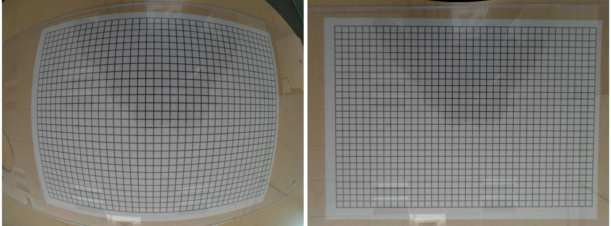

# Discorpy
(**Dis**)tortion (**Cor**)rection (**Py**)thon-package

*Camera calibration and distortion correction software for lens-based detector systems*

 
 
 
 
 
 
 

**Discorpy** is an open-source Python package implementing methods for calibrating and correcting distortion 
in lens-based imaging systems ([1](https://doi.org/10.1364/OE.23.032859), [2](https://doi.org/10.1107/S1600577525002267)). 
Unlike existing approaches that require multiple calibration images or iterative optimization, 
Discorpy and its algorithms can independently characterize both radial and perspective distortion 
with high accuracy across a wide range of distortion strengths—using only a single calibration image 
and direct computation. This makes the software a practical tool for a wide range of imaging applications.

**Author and maintainer:** Nghia Vo, *NSLS-II, Brookhaven National Laboratory, US; Diamond Light Source, UK.*

Features
========
- The [polynomial model](https://discorpy.readthedocs.io/en/latest/tutorials/methods.html#calculating-coefficients-of-a-polynomial-model-for-radial-distortion-correction) 
  used by the package is versatile enough to calibrate images with varying levels of 
  radial distortion. This practical feature eliminates the need for users to switch 
  between different models based on the degree of distortion in the images.
- Discorpy offers a unique feature where [radial distortion, the center of distortion, and perspective distortion](https://discorpy.readthedocs.io/en/latest/tutorials/methods.html)
  can be independently determined and corrected using a single calibration image.
- The software provides a full pipeline of data processing including:
  + [Pre-processing methods](https://discorpy.readthedocs.io/en/latest/api.html#pre-processing) 
    for: extracting reference-points from a dot-pattern image, line-pattern image, 
    and chessboard (checkerboard) image; grouping these points line-by-line.
  + [Processing methods](https://discorpy.readthedocs.io/en/latest/api.html#processing) for calculating 
    the optical center, coefficients of polynomial models for correcting radial distortion, and parameters 
    of a model for correcting perspective distortion.
  + [Post-processing methods](https://discorpy.readthedocs.io/en/latest/api.html#post-processing) for: 
    unwarping lines of points, images, or slices of a 3D dataset; and evaluating the accuracy of the correction results.
  + Some methods may be useful for other applications:
    * [Correct non-uniform background](https://discorpy.readthedocs.io/en/latest/api/discorpy.prep.preprocessing.html#discorpy.prep.preprocessing.normalization_fft) of an image.
    * Select [binary objects](https://discorpy.readthedocs.io/en/latest/api/discorpy.prep.preprocessing.html#discorpy.prep.preprocessing.select_dots_based_distance) in a certain range of values.
    * Unwarp slices of a [3D dataset](https://discorpy.readthedocs.io/en/latest/api/discorpy.post.postprocessing.html#discorpy.post.postprocessing.unwarp_slice_backward).

Installation
============

- https://discorpy.readthedocs.io/en/latest/install.html

Documentation
=============

- https://discorpy.readthedocs.io/en/latest/

Usage
=====

- To achieve high-accuracy results, the quality of the calibration image is crucial. 
  An ideal calibration image should contain [numerous reference points](https://discorpy.readthedocs.io/en/latest/tutorials/methods.html#extracting-reference-points-from-a-calibration-image) 
  extracted from [dot-patterns, line-patterns](https://github.com/DiamondLightSource/discorpy/tree/master/data), 
  or [checkerboard images](https://github.com/DiamondLightSource/discorpy/tree/master/data/laptop_camera), covering most of 
  the camera's field of view and minimizing perspective distortion.
- https://discorpy.readthedocs.io/en/latest/usage.html

Demonstrations
==============

- Detailed step-by-step demonstrations featuring codes and explanations of how to use Discorpy for various types of calibration images
  are shown [here](https://discorpy.readthedocs.io/en/latest/usage.html#demonstrations). 

- Apply to a visible dot-target collected at [Beamline I12](https://www.diamond.ac.uk/Instruments/Imaging-and-Microscopy/I12/Detectors-at-I12.html),
  Diamond Light Source, UK:

    

    

- Apply to an X-ray dot-target collected at [Beamline I13](https://www.diamond.ac.uk/Instruments/Imaging-and-Microscopy/I13/Diamond-Manchester_Imaging_Branchline/Facilities_and_equipment_Imaging.html),
  Diamond Light Source, UK:

    

    

- Improvement of tomographic reconstructed images after distortion correction:
  + For a detector with strong radial distortion:
    
    
    
  + For a detector with small radial distortion:
    
    

- Calibrate a commercial camera with capabilities of correcting [radial distortion and perspective distortion](https://discorpy.readthedocs.io/en/latest/usage/demo_05.html)
  independently.

  

- Calibrate a laptop [webcam](https://discorpy.readthedocs.io/en/latest/usage/demo_06.html) using a checkboard image.
  
  

  

- Calibrate a fisheye camera (GoPro Hero-8).
 
  

- Apply to a hazard camera of the [Mars Perseverance Rover](https://mars.nasa.gov/mars2020/multimedia/raw-images/).
  Details of how to estimate distortion coefficients of that camera without using
  a calibration target are shown [here](https://discorpy.readthedocs.io/en/latest/usage/demo_08.html).  

    

    

- Correct [perspective distortion](https://discorpy.readthedocs.io/en/latest/usage/demo_07.html):

    
