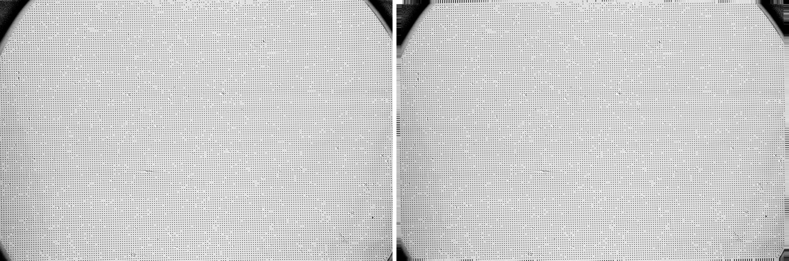

# Vounwarp

## Distortion correction package


**Vounwarp** is an open-source Python package for radial distortion correction 
with sub-pixel accuracy as required by tomography detector systems. 
It calculates parameters of a polynomial model of radial lens distortion, which 
are the center of distortion and the polynomial coefficients, using a grid 
pattern image. The package implements methods published, Nghia T. Vo et al.
"Radial lens distortion correction with sub-pixel accuracy for X-ray micro-
tomography" Optics Express 23, 32859-32868 (2015), 
https://doi.org/10.1364/OE.23.032859. 

Features
========
- Pre-processing methods for finding coordinates of dot-centroids, grouping them
 into lines, removing non-dot objects or misplaced dots.
- Procesing methods for calculating distortion parameters; which are the 
center of distortion and polynomial coefficients; of a backward model, a forward
model, and a backward-from-forward model.
- Post-processing methods for: unwarping lines of points, images, or slices of 
a 3D dataset; evaluating the accuracy of correction results.
- Some methods may be useful for other applications:
  * Correct non-uniform background using a FFT-based filter and a median filter.
  * Select binary objects in a certain range of values.
  * Unwarp slices of a 3D dataset.

Install
=======
- *vounwarp* is available on the conda-forge channel. To install: 1) Install 
[Miniconda](https://docs.conda.io/en/latest/miniconda.html) (just to run conda) 
or [Anaconda](https://www.anaconda.com/products/individual) (conda + loads of 
python packages). 2) Open a command prompt/terminal and run the following command:
```commandline
$ conda install -c conda-forge vounwarp
```
- To install from the source codes:
    * Download the source codes from this github page (click-> Code -> Download ZIP). 
    Unzip to a local folder.
    * Install [Miniconda](https://docs.conda.io/en/latest/miniconda.html).
    * Open command prompt, navigate to the source folder, run the following 
    commands:
        ```commandline
        $ conda create -n vounwarp
        $ conda activate vounwarp
        $ conda install python
        $ python setup.py install
        ```

How to use
==========
- A document explaining step-by-step how to calculate distortion coefficients 
from a dot pattern image is in the "/doc" folder or can be downloaded from: 
https://zenodo.org/record/1322720 
- Examples of how to use the package are in the "/examples" folder.
- Coefficients determined by the package can be used by other tomographic 
software such as [Tomopy](https://tomopy.readthedocs.io/en/latest/api/tomopy.prep.alignment.html) or
[Savu](https://github.com/DiamondLightSource/Savu/blob/master/savu/plugins/corrections/distortion_correction.py) 
for correction.

Demonstrations
==============
- Apply to a visible dot-target collected at [Beamline I12](https://www.diamond.ac.uk/Instruments/Imaging-and-Microscopy/I12/Detectors-at-I12.html),
Diamond Light Source, UK:


- Apply to an X-ray dot-target collected at [Beamline I13](https://www.diamond.ac.uk/Instruments/Imaging-and-Microscopy/I13/Diamond-Manchester_Imaging_Branchline/Facilities_and_equipment_Imaging.html),
Diamond Light Source, UK:




- Apply to a hazard camera of the [Mars Perseverance Rover](https://mars.nasa.gov/mars2020/multimedia/raw-images/).
Details of how to estimate distortion coefficients of that camera without using
a calibration target are shown [here](https://github.com/DiamondLightSource/vounwarp/blob/master/examples/Perseverance_distortion_correction/Distortion_correction_for_Perseverance_camera.md)  

