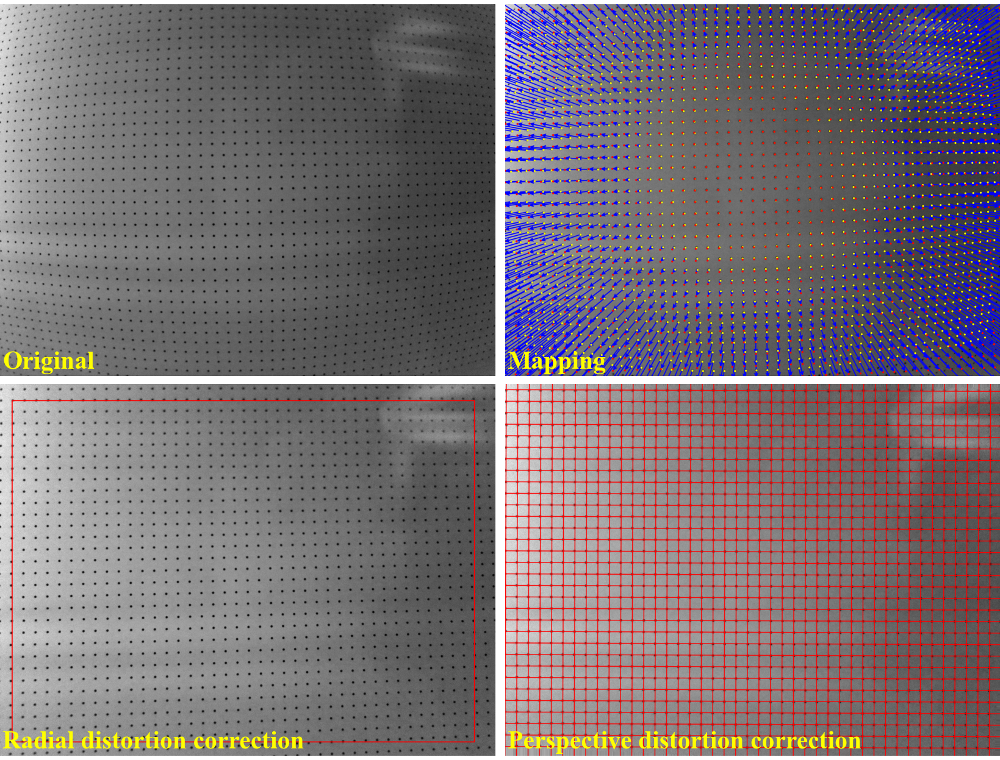

Discorpy's documentation
========================

Discorpy is an open-source Python package implementing methods for calibrating and correcting distortion
in lens-based imaging systems :cite:`Vo:2015` :cite:`Vo:2025`. Unlike existing approaches that require multiple calibration
images or iterative optimization, Discorpy and its algorithms can independently characterize both radial and
perspective distortion with high accuracy across a wide range of distortion strengths - using only a single calibration
image and direct computation. This makes the software a practical tool for a wide range of imaging applications.

To support different experimental conditions and enable fully automated workflows, Discorpy offers flexibility in
calibration patterns, including dot-pattern, line-pattern, and chessboard images. It also provides robust preprocessing
methods for extracting reference points, handling image artifacts, and grouping points into lines. Discorpy has been
successfully applied to calibrate detectors in X-ray tomography systems, where sub-pixel accuracy is critical,
as well as to correct fisheye distortion in large-field-of-view cameras.

**Showcases**: https://discorpy.readthedocs.io/en/latest/usage.html#demonstrations

**Source code:** https://github.com/DiamondLightSource/discorpy

**Author:** Nghia T. Vo - NSLS-II, Brookhaven National Laboratory, US; Diamond Light Source, UK.

**Keywords:** Camera calibration, radial lens distortion, perspective distortion,
distortion correction, fisheye distortion, distortion center determination, tomography.

Contents
========

.. toctree::
    :maxdepth: 3
    :numbered:

    install
    tutorials
    usage
    notes
    api
    updates
    credit
