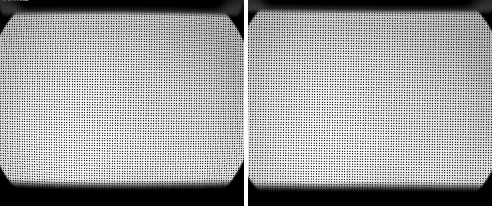
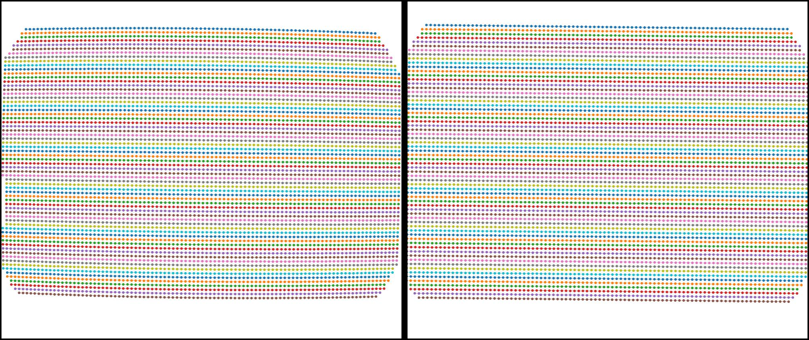

Discorpy's documentation
========================

Discorpy is an open-source Python package for radial distortion correction
with sub-pixel accuracy as required by tomography detector systems :cite:`Vo:2015`.
It is used to calculate parameters of a polynomial model of radial lens distortion,
which are the center of distortion and the polynomial coefficients, using a grid
pattern image.

Since version 1.4, correction for perspective distortion is added to
Discorpy. Methods for processing line-pattern and chessboard image are also
included in the package.

A key feature of methods implemented in Discorpy, compared to other software,
is that radial distortion, the center of distortion, and perspective distortion
are determined and corrected independently using a single calibration image.
Discorpy was developed for calibrating lens-coupled detectors of tomography
systems but it also can be used for commercial cameras.

|

|

|

**Source code:**

https://github.com/DiamondLightSource/discorpy

**Author:**

Nghia T. Vo - Diamond Light Source, UK.

**Keywords:**

Camera calibration, radial lens distortion, perspective distortion, distortion
correction, tomography.

Contents
========

.. toctree::
   :maxdepth: 3
   :numbered:

   install
   tutorials
   usage
   api
   credit
