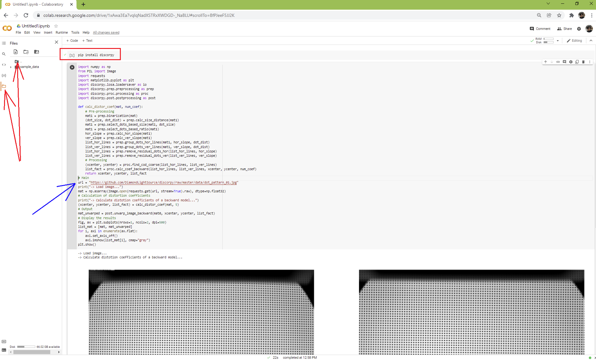

============
Installation
============

Discorpy is a Python library not an app. Users have to write Python codes to
process their data. For beginners, a quick way to get started with Python
programming is to install `Anaconda <https://www.anaconda.com/products/individual>`__,
then follow instructions `here <https://docs.anaconda.com/anaconda/user-guide/getting-started/>`__.
There are many IDE software can be used to write and run Python codes e.g Spyder,
Pydev, Pycharm, or Visual Studio Code. After installing these software, users
need to configure Python interpreter by pointing to the installed location of
Anaconda. Each software has instructions of how to do that. There is a list of standard
Python libraries shipped with `Anaconda <https://docs.anaconda.com/anaconda/packages/pkg-docs/>`__,
known as the *base* environment. To install a Python package out of the list, it's a good
practice that users should create a separate environment from the base.
This `tutorial <https://www.freecodecamp.org/news/why-you-need-python-environments-and-how-to-manage-them-with-conda-85f155f4353c/>`__
gives an overview about Python environment. Instructions of how to create a new
environment and how to install new packages are `here <https://docs.conda.io/projects/conda/en/latest/user-guide/tasks/manage-environments.html>`__
and `here <https://docs.conda.io/projects/conda/en/latest/user-guide/tasks/manage-pkgs.html>`__.
Note that the IDE software needs to be reconfigured to point to the new environment.
If users don't want to install Anaconda which is quite heavy due to the base
environment shipped with it, `Miniconda <https://docs.conda.io/projects/conda/en/latest/user-guide/install/download.html>`__
is enough to customize Python environment.

Using conda
-----------

- Install Miniconda as instructed above.
- Open terminal or command prompt and run the following commands:

    + If install to an existing environment:

      .. code-block:: console

         conda install -c conda-forge discorpy

    + If install to a new environment:

      .. code-block:: console

         conda create -n discorpy
         conda activate discorpy
         conda install python
         conda install -c conda-forge discorpy

Using pip
---------

- Install Miniconda as instructed above.
- Open terminal or command prompt and run the following commands:

    + If install to an existing environment:

      .. code-block:: console

         pip install discorpy

    + If install to a new environment:

      .. code-block:: console

         conda create -n discorpy
         conda activate discorpy
         conda install python
         pip install discorpy

Installing from source
----------------------

- Download the source from `github <https://github.com/DiamondLightSource/discorpy>`__ (click-> Code -> Download ZIP).
  Unzip to a local folder.
- Install `Miniconda <https://docs.conda.io/en/latest/miniconda.html>`__ or Anaconda as shown above.
- Open command prompt, navigate to the source folder, run the following
  commands:

  .. code-block:: console

     conda create -n discorpy
     conda activate discorpy
     conda install python
     python setup.py install

Using Google Colab
------------------

Above instructions are for installing Discorpy locally. Users can also run
Discorpy remotely on `Google Colab <https://colab.research.google.com/>`__. This
requires a Google account. As shown in the screenshot below, Discorpy is installed
by running "pip install discorpy" at the first line of the notebook. Images can
be upload/download to/from a Google Drive or a url address.

