.. _fisheye:

Distortion calibration and correction for fisheye cameras
=========================================================

Introduction
------------

Methods for correcting fisheye distortion are a subset of techniques for correcting radial distortion in
lens-based cameras and have a long history of development. Various models can be used `[Hughes-2008] <https://doi.org/10.1049/cp:20080656>`__,
and different approaches exist for calculating the parameters of these models. A common method involves acquiring a
calibration image that provides grid lines, such as a dot-pattern, line-pattern, or chessboard pattern.
Under radial distortion, these lines appear curved. By using known properties—such as grid lines being parallel,
perpendicular, or equally spaced—different approaches can be derived to calculate the parameters of the
distortion model.

In practice, perspective distortion and an offset distortion center are often present in the acquired image.
This makes it challenging to calculate radial distortion parameters, as these additional distortions
influence the observed patterns. There are two main approaches to address this problem. The first uses only a
single calibration image and applies iterative optimization, based on the assumption that grid lines in
the undistorted space should be straight `[Hughes-2010] <https://doi.org/10.1364/AO.49.003338>`__ ,
`[Devernay] <https://doi.org/10.1007/PL00013269>`__. This method has the advantage of requiring only one image, but it
does not guarantee convergence to a correct solution.

The second approach uses multiple calibration images, allowing to calculate parameters of
multiple distortion models. A well-known implementation of this approach is provided in OpenCV `[Zhang] <https://doi.org/10.1109/34.888718>`__.
However, it can be challenging for inexperienced users to `acquire calibration images correctly <https://stackoverflow.com/search?q=camera-calibration+fisheye>`__.
Moreover, its accuracy is limited because the polynomial model used includes only  `even-order terms <https://docs.opencv.org/4.x/dc/dbb/tutorial_py_calibration.html>`__.

As mentioned in the :ref:`methods <methods>` section, the methods implemented and developed for Discorpy were initially
used for scientific purposes, where sub-pixel accuracy is strictly required. The inclusion of the capability to
calibrate perspective distortion and radial distortion independently, starting from version 1.4, enables the use of
Discorpy beyond the scientific community. Given that previous algorithms in Discorpy were mainly focused on calibrating
small-to-medium distortions, methods for calibrating strong distortion have been developed by the author,
published in :cite:`Vo:2025`, and added to Discorpy in version 1.7. These focus on several key areas: grouping points
on strongly curved lines, calculating the center of distortion in the presence of significant distortion and perspective effect,
and applying perspective correction to reference-points before calculating the polynomial coefficients of radial distortion.
With this latest development, Discorpy stands out for its versatility in correcting various strengths of distortion.
It can independently characterize radial distortion, perspective distortion, and the optical center using a single
calibration image. Details of the methods can be found in :cite:`Vo:2025`, the following presents how they can be used
to calibrate a fisheye camera.

Acquiring calibration image
---------------------------

Good practices for acquiring high-quality calibration images include maximizing the grid pattern's coverage of the
camera's field of view, minimizing background light variance, ensuring the pattern object is flat, and minimizing
perspective effects by adjusting the target or camera to be as close to parallel as possible. While Discorpy can
handle challenging images, following these practices helps ensure that the calibration workflow runs smoothly with
minimal need for adjusting method parameters.

Depending on the pixel dimensions (height and width) of the camera, using the utility module of Discorpy to
generate a pattern image is as follows.

.. code-block:: python

    import discorpy.util.utility as util
    import discorpy.losa.loadersaver as losa

    output_base = "E:/calibration_pattern/"

    # Adjust height, width, size, distance... depending on the camera info
    height = 3000
    width = 4000

    dot_pattern = util.make_dot_pattern(height=height, width=width,
                                        dot_distance=50, dot_size=21, margin=50)
    losa.save_image(output_base + "/dots.jpg", dot_pattern)

    line_pattern = util.make_line_pattern(height=height, width=width,
                                          line_distance=100, line_size=9, margin=50)
    losa.save_image(output_base + "/lines.jpg", line_pattern)

    chessboard = util.make_chessboard(height=height, width=width, size=100, margin=50)
    losa.save_image(output_base + "/chessboard.jpg", chessboard)

Although dot-pattern and chessboard images can be used, the line-pattern is recommended, as it is
easier to group points into lines—a critical step in the calibration workflow. The line-pattern image
was printed and placed in the middle of plexiglass sheets to ensure it remained flat. The calibration
image was then acquired using a GoPro Hero8 camera (:numref:`fisheye_fig_1`).

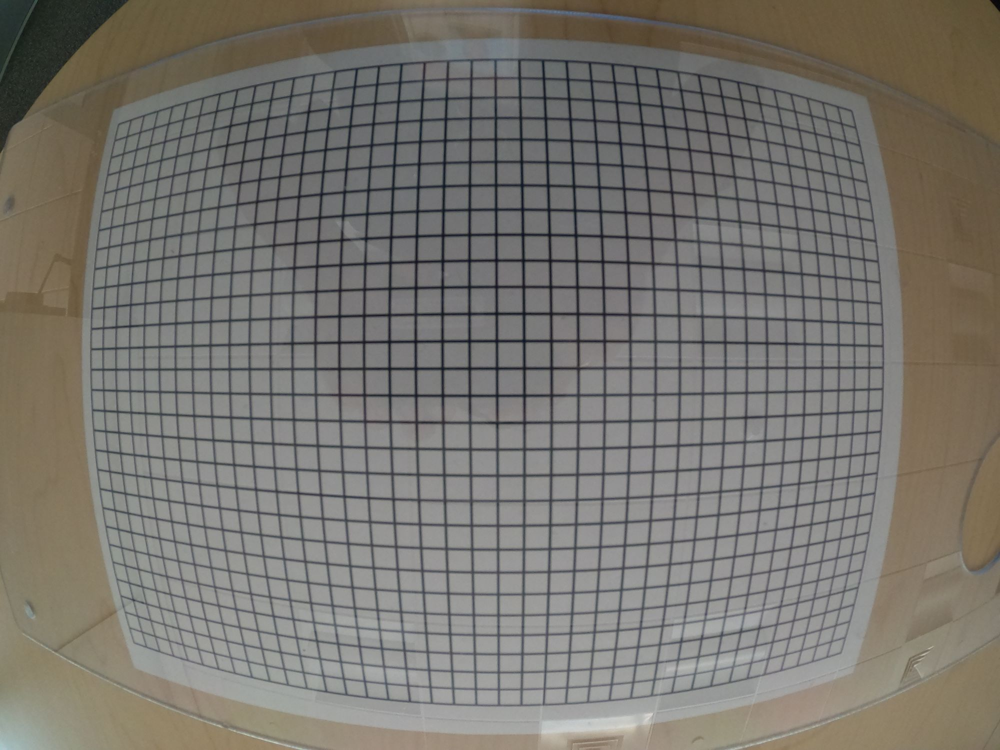

    Calibration image using a line-pattern printed on paper and flattened with plexiglass sheets, acquired with
    a GoPro Hero8 camera.

Preprocessing steps
-------------------

As the lines are strongly curved, line detection is broken down into a point-to-line association problem, as described
in the :ref:`method <line_pattern>` section. The following shows Discorpy's API for extracting these points.

.. code-block:: python

    import discorpy.losa.loadersaver as losa
    import discorpy.prep.preprocessing as prep
    import discorpy.prep.linepattern as lprep
    import discorpy.proc.processing as proc
    import discorpy.post.postprocessing as post
    import discorpy.util.utility as util
    import matplotlib.pyplot as plt

    file_path = r"D:\data\fisheye\GoPro8_line_pattern.jpg"

    print("  1-> Load image ...")
    img0 = losa.load_image(file_path)
    (height, width) = img0.shape
    img_norm = prep.normalization_fft(img0, 10)

    print("  2-> Calculate slope and distance between lines...")
    slope_hor, dist_hor = lprep.calc_slope_distance_hor_lines(img_norm, chessboard=False)
    slope_ver, dist_ver = lprep.calc_slope_distance_ver_lines(img_norm, chessboard=False)
    print(f"       Horizontal slope: {slope_hor} Distance: {dist_hor}")
    print(f"       Vertical slope  : {slope_ver} Distance: {dist_ver}")
    print("  3-> Extract reference-points !!!!")

    # Detect points on lines. Lines are dark, background is bright.
    list_points_hor_lines = lprep.get_cross_points_hor_lines(img_norm, slope_ver, dist_ver,
                                                             bgr='bright', chessboard=False,
                                                             radius=9, sensitive=0.1,
                                                             select_peaks=False)
    list_points_ver_lines = lprep.get_cross_points_ver_lines(img_norm, slope_hor, dist_hor,
                                                             bgr='bright', chessboard=False,
                                                             radius=9, sensitive=0.1,
                                                             select_peaks=False)

    plt.imshow(img_norm, origin="lower")
    plt.plot(list_points_hor_lines[:, 1], list_points_hor_lines[:, 0], ".", color="red")
    plt.plot(list_points_ver_lines[:, 1], list_points_ver_lines[:, 0], ".", color="blue")
    plt.show()

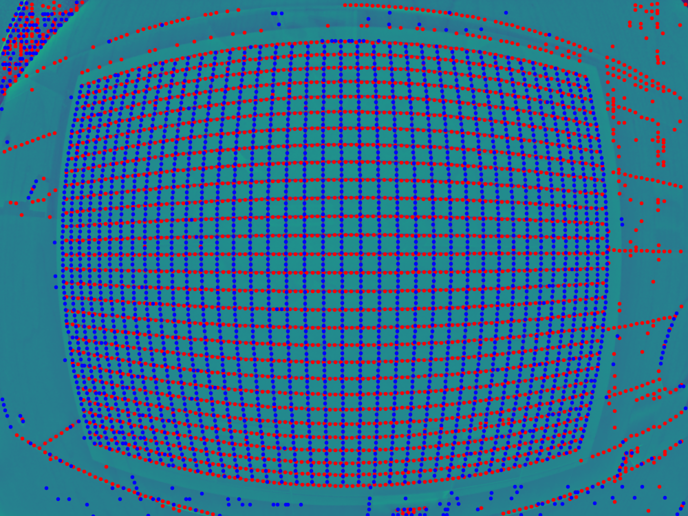

    Points extracted from the line-pattern image.

As the point detection method uses local minima to detect points, some unwanted points may be picked up.
These points can be ignored in the next step of the workflow, which involves grouping points into lines.
However, removing unwanted points by masking and/or adjusting the parameters of the point detection method
can make the subsequent steps easier. The following Python code demonstrates how to perform these removal steps.

.. code-block:: python

    ## For viewing the mask
    # mask = prep.make_parabola_mask(height, width,hor_curviness=0.4, ver_curviness=0.3,
    #                                hor_margin=(400, 300), ver_margin=(150, 200))
    # plt.imshow(img_norm * mask, origin="lower")
    # plt.show()
    list_points_hor_lines = prep.remove_points_using_parabola_mask(list_points_hor_lines,
                                                                   height, width,
                                                                   hor_curviness=0.4,
                                                                   ver_curviness=0.3,
                                                                   hor_margin=(400, 300),
                                                                   ver_margin=(150, 200))

    list_points_ver_lines = prep.remove_points_using_parabola_mask(list_points_ver_lines,
                                                                   height, width,
                                                                   hor_curviness=0.4,
                                                                   ver_curviness=0.3,
                                                                   hor_margin=(400, 300),
                                                                   ver_margin=(150, 200))
    plt.imshow(img_norm, origin="lower")
    plt.plot(list_points_hor_lines[:, 1], list_points_hor_lines[:, 0], ".", color="red")
    plt.plot(list_points_ver_lines[:, 1], list_points_ver_lines[:, 0], ".", color="blue")
    plt.show()

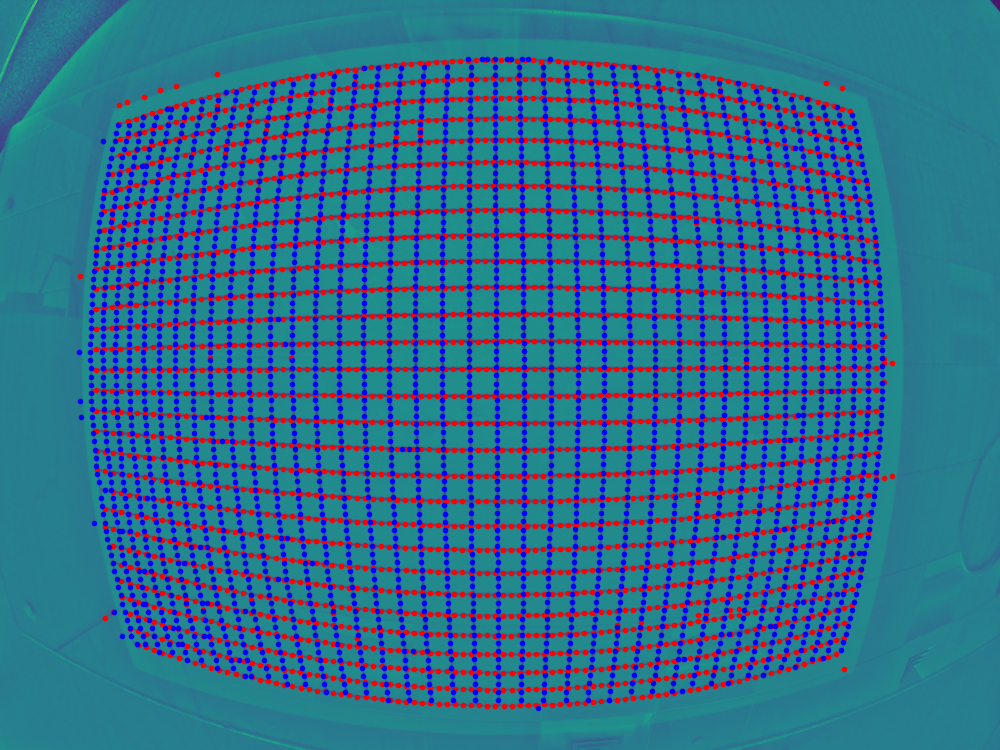

    Removing unwanted points using mask.

Points are then grouped into horizontal lines and vertical lines

.. code-block:: python

    print("  4-> Group points into lines !!!!")
    list_hor_lines = prep.group_dots_hor_lines_based_polyfit(list_points_hor_lines,
                                                             slope_hor, dist_hor,
                                                             ratio=0.1,
                                                             num_dot_miss=3,
                                                             accepted_ratio=0.65,
                                                             order=2)
    list_ver_lines = prep.group_dots_ver_lines_based_polyfit(list_points_ver_lines,
                                                             slope_ver, dist_ver,
                                                             ratio=0.1,
                                                             num_dot_miss=3,
                                                             accepted_ratio=0.65,
                                                             order=2)

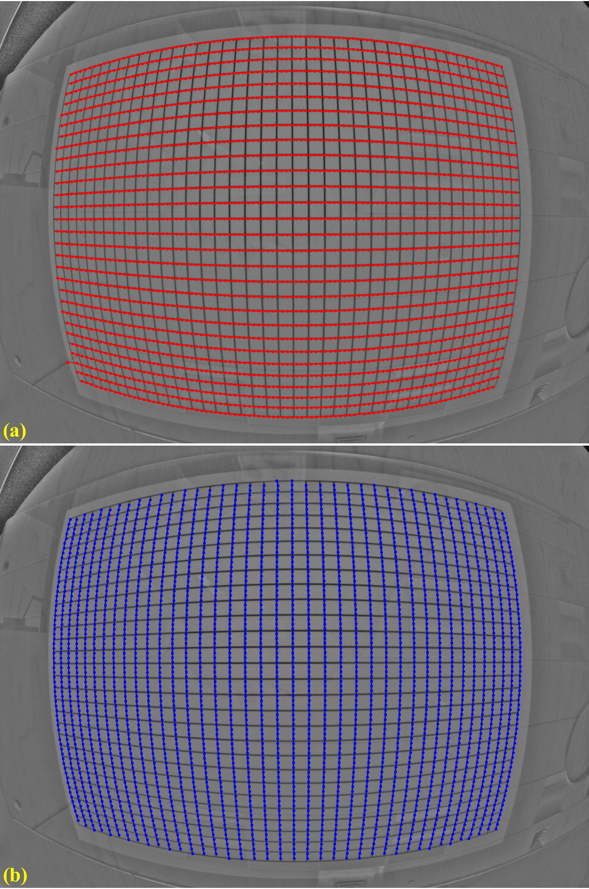

    Group points into: (a) horizontal lines. (b) vertical lines.

Outliers can be removed using the following API function

.. code-block:: python

    list_hor_lines = prep.remove_residual_dots_hor(list_hor_lines, slope_hor, 3.0)
    list_ver_lines = prep.remove_residual_dots_ver(list_ver_lines, slope_ver, 3.0)

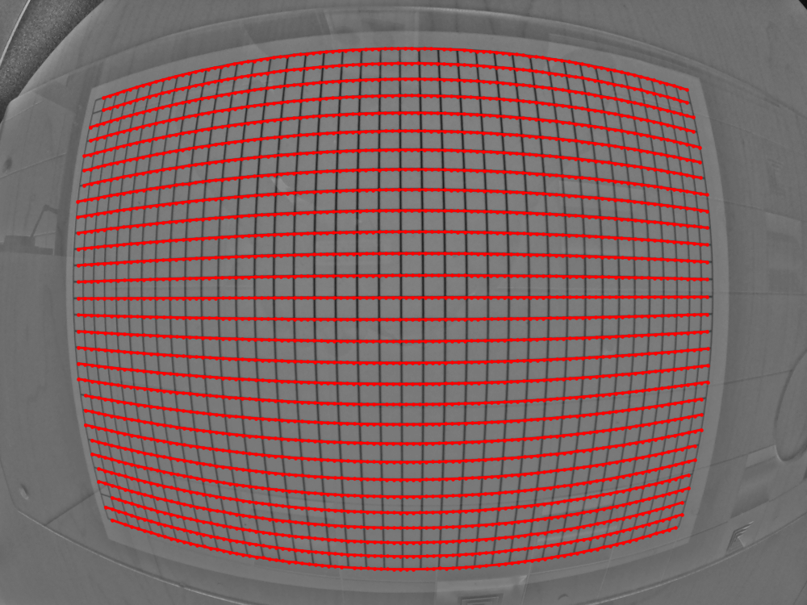

    An outlier at the bottom-left of :numref:`fisheye_fig_4` (a) has been removed.

Processing steps
----------------

The next step is to calculate the distortion center for radial distortion. This is a crucial step to ensure
accurate results, given the presence of perspective distortion. As explained in :cite:`Vo:2025`
the method is based on using the vanishing point approaches.

.. code-block:: python
    :emphasize-lines: 4

    xcenter, ycenter = proc.find_center_based_vanishing_points_iteration(list_hor_lines,
                                                                         list_ver_lines, iteration=2)
    print(f" Center of distortion: X-center {xcenter}. Y-center {ycenter}")
    #>> Center of distortion: X-center 2004.2138466438653. Y-center 1525.2905119790387

The impact of perspective distortion can be visualized using the fitted parabola coefficients of
horizontal and vertical lines, where the b-coefficients vary with the c-coefficients (:numref:`fisheye_fig_6`)
instead of remaining close to constant.

.. code-block:: python

    list_hor_coef, _ = proc._para_fit_hor(list_hor_lines, xcenter, ycenter)
    list_ver_coef, _ = proc._para_fit_ver(list_ver_lines, xcenter, ycenter)
    plt.plot(list_hor_coef[:, 2], -list_hor_coef[:, 1], "-o", color="red", label="horizontal")
    plt.plot(list_ver_coef[:, 2], list_ver_coef[:, 1], "-o", color="blue", label="vertical")
    plt.legend(loc="upper left")
    plt.xlabel("c-coefficient")
    plt.ylabel("b-coefficient", labelpad=-5)
    plt.show()

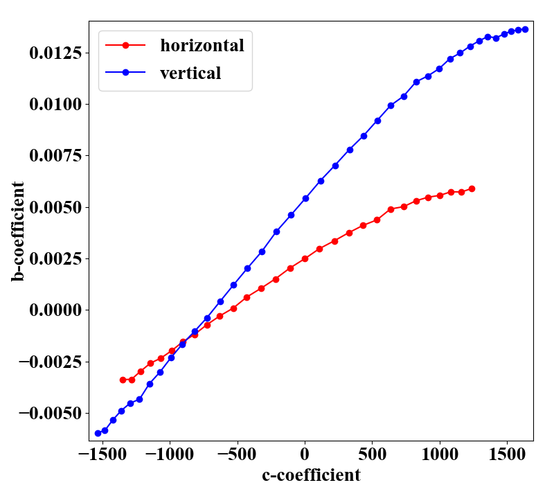

    Relationship between :math:`b`- and :math:`c`-coefficients under the impact of perspective distortion.

Another critical development in Discorpy 1.7 is the ability to correct perspective distortion, as explained
in :cite:`Vo:2025` and in the :ref:`method section <methods>`, which can be done with a single line of code.
As can be seen in :numref:`fisheye_fig_7`, the variation of the slope of lines after perspective distortion is
under 0.0035

.. code-block:: python

    corr_hor_lines, corr_ver_lines = proc.correct_perspective_effect(list_hor_lines, list_ver_lines,
                                                                     xcenter, ycenter)
    # To check the results
    list_hor_coef, _ = proc._para_fit_hor(corr_hor_lines, xcenter, ycenter)
    list_ver_coef, _ = proc._para_fit_ver(corr_ver_lines, xcenter, ycenter)
    plt.plot(list_hor_coef[:, 2], -list_hor_coef[:, 1], "-o", color="red", label="horizontal")
    plt.plot(list_ver_coef[:, 2], list_ver_coef[:, 1], "-o", color="blue", label="vertical")
    plt.legend(loc="upper left")
    plt.xlabel("c-coefficient")
    plt.ylabel("b-coefficient", labelpad=-5)
    plt.show()

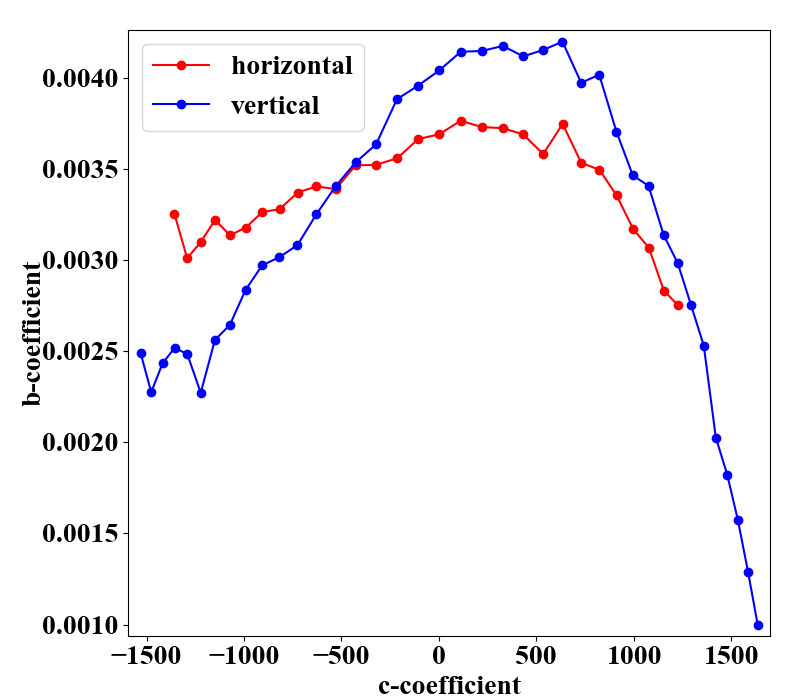

    Relationship between :math:`b`- and :math:`c`-coefficients after perspective distortion correction.

Calculating the coefficients of the backward model for radial distortion is straightforward and fast. The coefficients
and distortion center can be saved as a .json file or .txt file for later use.

.. code-block:: python
    :emphasize-lines: 6

    num_factor = 5
    list_bfact = proc.calc_coef_backward(corr_ver_lines, corr_ver_lines, xcenter, ycenter, num_factor)
    print(f" Polynomial coefficients of radial distortion: {list_bfact}")
    losa.save_metadata_json("E:/tmp/results/distortion_parameters.json", xcenter, ycenter, list_bfact)

    #>> Polynomial coefficients of radial distortion: [ 1.00436507e+00  2.20747615e-05 -1.39181487e-07  4.66637301e-11 -5.39892968e-15]

Correction results
-------------------

Using the calculated coefficients, we can apply distortion correction to the point lines, as shown below

.. code-block:: python

    list_hor_ulines = post.unwarp_line_backward(list_hor_lines, xcenter, ycenter,
                                                list_bfact)
    list_ver_ulines = post.unwarp_line_backward(list_ver_lines, xcenter, ycenter,
                                                list_bfact)
    plt.figure(0, figsize=(15, 9))
    for line in list_hor_lines:
        plt.plot(line[:, 1], line[:, 0], "-o", color="red")
    for line in list_hor_ulines:
        plt.plot(line[:, 1], line[:, 0], "-o", color="green")

    plt.figure(1, figsize=(15, 9))
    for line in list_ver_lines:
        plt.plot(line[:, 1], line[:, 0], "-o", color="blue")
    for line in list_ver_ulines:
        plt.plot(line[:, 1], line[:, 0], "-o", color="green")
    plt.show()

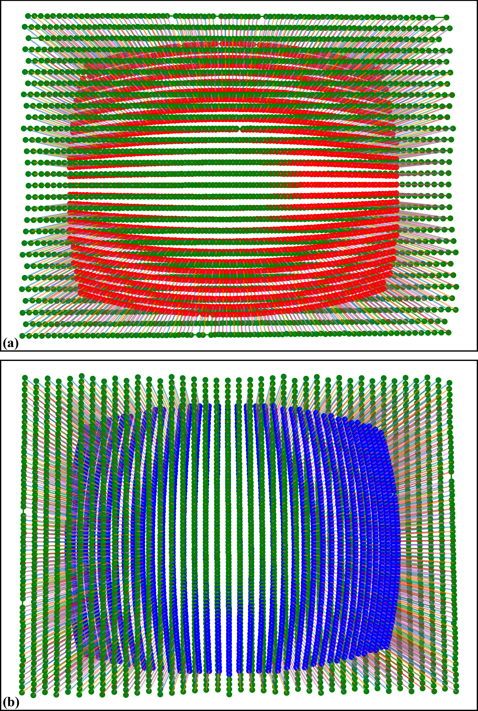

    Unwarped points on horizontal lines (a) . Unwarped points on vertical lines (b).

The straightness of the lines can be evaluated by measuring the distance of the unwarped points
from their fitted lines (:numref:`fisheye_fig_9` and :numref:`fisheye_fig_10`).

.. code-block:: python

    residual_hor_lines = post.calc_residual_hor(list_hor_lines, xcenter, ycenter)
    residual_hor_ulines = post.calc_residual_hor(list_hor_ulines, xcenter, ycenter)
    residual_ver_lines = post.calc_residual_ver(list_ver_lines, xcenter, ycenter)
    residual_ver_ulines = post.calc_residual_ver(list_ver_ulines, xcenter, ycenter)

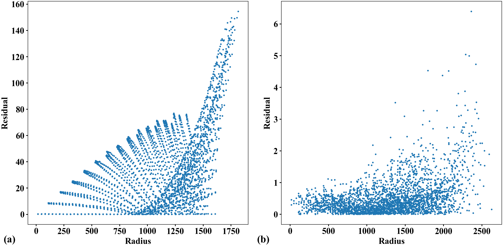

    Plot of points distances from their fitted straight line in the horizontal direction versus their distances
    from the origin: (a) Before radial distortion correction, (b) After correction.

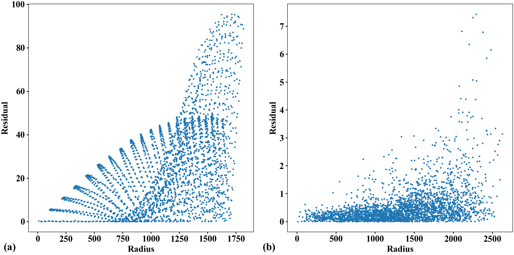

    Plot of points distances from their fitted straight line in the vertical direction versus their distances
    from the origin: (a) Before radial distortion correction, (b) After correction.

Unwarping the calibration image is a straightforward process.

.. code-block:: python

    file_path = r"D:\data\fisheye\GoPro8_line_pattern.jpg"
    img0 = losa.load_image(file_path, average=False)
    pad = 400  # To maintain the original view, we need to pad the image.
    output_path = r"D:\data\fisheye\GoPro8_line_pattern_corrected.jpg"
    img_corr = util.unwarp_color_image_backward(img0, xcenter, ycenter, list_bfact, pad=pad)
    ###  Or using a wrapper of OpenCV-remap backend for fast computing. OpenCV need to be installed.
    # img_corr = util.unwarp_image_backward_cv2(img0, xcenter, ycenter, list_bfact, pad=pad)
    losa.save_image(output_path, img_corr)

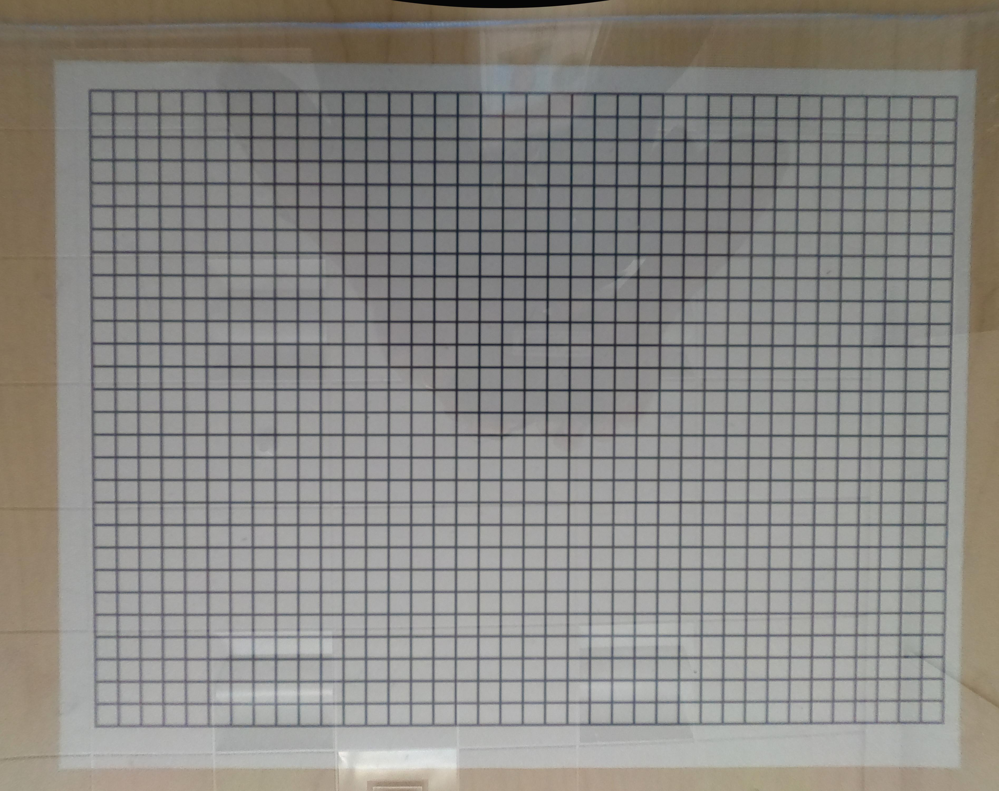

    Unwarped calibration image from :numref:`fisheye_fig_1`. Padding is used as the unwarping process expands the image.

Given the distortion coefficients, we can apply the correction to other images acquired by the same camera.

.. code-block:: python

    test_img = losa.load_image(r"D:\data\fisheye\GoPro8_testing_image.jpg", average=False)
    output_path = r"D:\data\fisheye\GoPro8_testing_image_corrected.jpg"
    img_corr = util.unwarp_color_image_backward(test_img, xcenter, ycenter, list_bfact, pad=400)
    losa.save_image(output_path, img_corr)

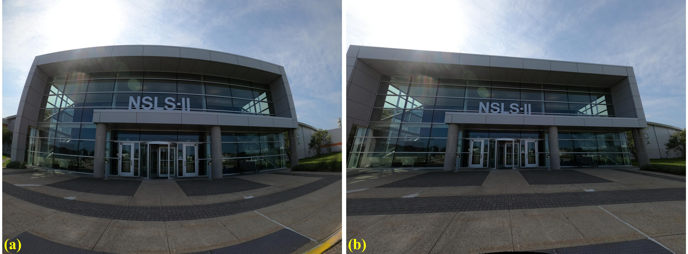

    Test image acquired with the same camera: (a) Before correction. (b) After correction.

To summarize, only a small amount of code is required to calibrate the camera, as shown below.

.. code-block:: python

    import discorpy.losa.loadersaver as losa
    import discorpy.prep.preprocessing as prep
    import discorpy.prep.linepattern as lprep
    import discorpy.proc.processing as proc
    import discorpy.post.postprocessing as post
    import discorpy.util.utility as util

    file_path = "D:/data/fisheye/GoPro8_line_pattern.jpg"
    output_base = "D:/data/fisheye/fisheye_correction/"
    num_factor = 5

    print("1-> Load image ...")
    img0 = losa.load_image(file_path)
    (height, width) = img0.shape
    img_norm = prep.normalization_fft(img0, 10)

    print("2-> Calculate slope and distance between lines...")
    slope_hor, dist_hor = lprep.calc_slope_distance_hor_lines(img_norm, chessboard=False)
    slope_ver, dist_ver = lprep.calc_slope_distance_ver_lines(img_norm, chessboard=False)
    print(f"       Horizontal slope: {slope_hor} Distance: {dist_hor}")
    print(f"       Vertical slope  : {slope_ver} Distance: {dist_ver}")
    print("3-> Extract reference-points !!!!")

    # Detect points on lines, lines are dark, background is bright.
    list_points_hor_lines = lprep.get_cross_points_hor_lines(img_norm, slope_ver, dist_ver, bgr='bright',
                                                             chessboard=False, radius=9, sensitive=0.1)
    list_points_ver_lines = lprep.get_cross_points_ver_lines(img_norm, slope_hor, dist_hor, bgr='bright',
                                                             chessboard=False, radius=9, sensitive=0.1)
    # Optional: Remove unwanted points at image border
    list_points_hor_lines = prep.remove_points_using_parabola_mask(
        list_points_hor_lines, height, width, hor_curviness=0.4, ver_curviness=0.3,
        hor_margin=(400, 300), ver_margin=(150, 200))

    list_points_ver_lines = prep.remove_points_using_parabola_mask(
        list_points_ver_lines, height, width, hor_curviness=0.4, ver_curviness=0.3,
        hor_margin=(400, 300), ver_margin=(150, 200))

    print("4-> Group points into lines !!!!")
    list_hor_lines = prep.group_dots_hor_lines_based_polyfit(list_points_hor_lines, slope_hor, dist_hor,
                                                             ratio=0.1, num_dot_miss=3, accepted_ratio=0.65, order=2)
    list_ver_lines = prep.group_dots_ver_lines_based_polyfit(list_points_ver_lines, slope_ver, dist_ver,
                                                             ratio=0.1, num_dot_miss=3, accepted_ratio=0.65, order=2)
    list_hor_lines = prep.remove_residual_dots_hor(list_hor_lines, slope_hor, 3.0)
    list_ver_lines = prep.remove_residual_dots_ver(list_ver_lines, slope_ver, 3.0)

    # Find center of distortion
    xcenter, ycenter = proc.find_center_based_vanishing_points_iteration(list_hor_lines, list_ver_lines, iteration=2)
    print(f"Center of distortion: X-center {xcenter}. Y-center {ycenter}")
    # Correct perspective distortion
    corr_hor_lines, corr_ver_lines = proc.correct_perspective_effect(list_hor_lines, list_ver_lines, xcenter, ycenter)
    # Calculate polynomial coefficients of the radial distortion
    list_bfact = proc.calc_coef_backward(corr_hor_lines, corr_ver_lines, xcenter, ycenter, num_factor)
    print(f"Polynomial coefficients of radial distortion: {list_bfact}")
    # Save parameters to json file for later use
    losa.save_metadata_json(output_base + "/distortion_parameters.json", xcenter, ycenter, list_bfact)

    # Load calibration image as color image
    img0 = losa.load_image(file_path, average=False)
    img_corr = util.unwarp_color_image_backward(img0, xcenter, ycenter, list_bfact, pad=400)
    ###  Using OpenCV-remap backend for fast computing.
    # img_corr = util.unwarp_image_backward_cv2(img0, xcenter, ycenter, list_bfact, pad=400)
    losa.save_image(output_base + "/corrected_img.jpg", img_corr)

Using other types of calibration images
---------------------------------------

Other types of calibration images can also be used and are straightforward to process using the Discorpy API.
The following shows the results of using a chessboard image. Both the `image <https://github.com/DiamondLightSource/discorpy/tree/master/data/fisheye>`__
and the `code <https://github.com/DiamondLightSource/discorpy/tree/master/examples>`__
are available on the Discorpy GitHub page. As can be seen, the calibration image clearly has perspective
distortion, but this is no longer a problem with the latest developments.

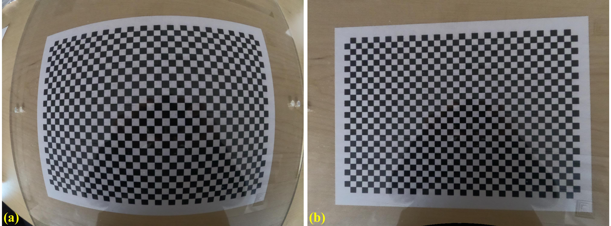

Radial distortion calibration using a chessboard image: (a) Before correction. (b) After correction.

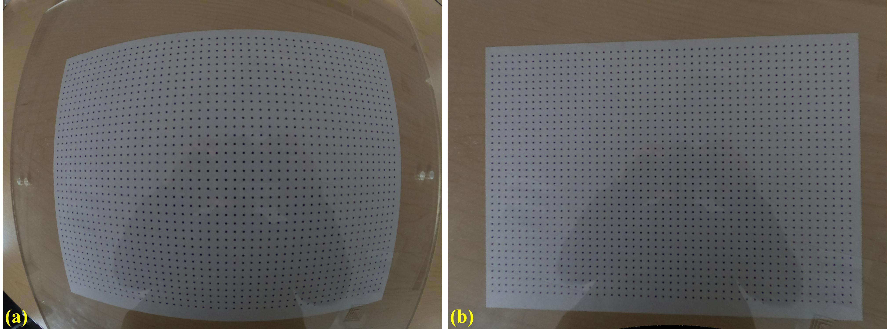

Radial distortion calibration using a dot-pattern image: (a) Before correction. (b) After correction.
