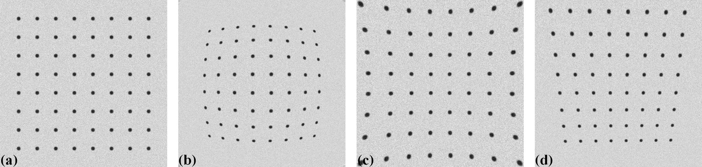
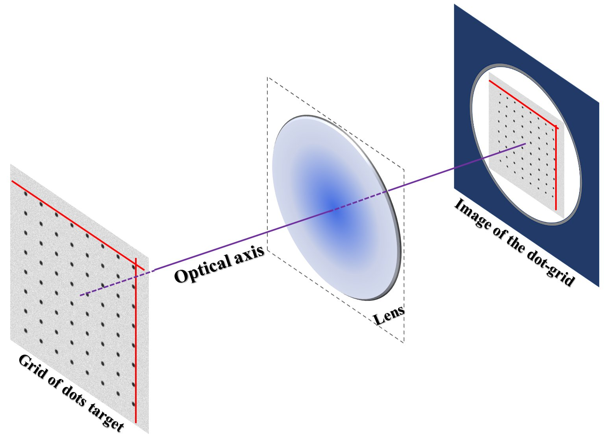
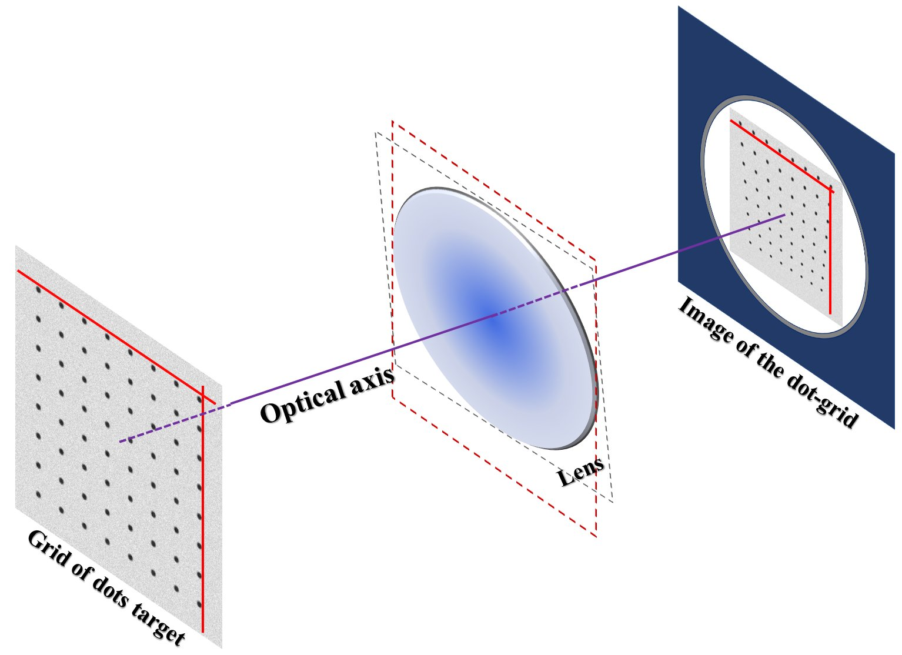
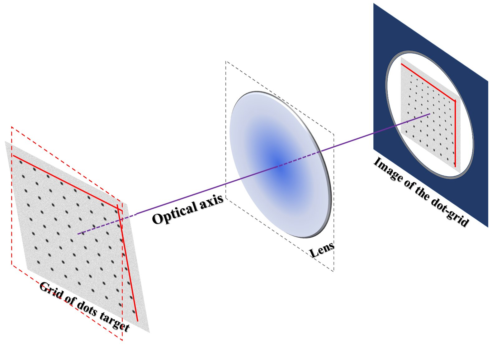

.. _distortion_causes:

Causes of distortion
====================

In a lens-coupled camera or detector, there are two major types of distortion
which may often be seen in an acquired image: radial distortion and perspective
distortion (:numref:`fig_1`).

    (a) Non-distorted image. (b) Barrel type of radial distortion.
    (c) Pincushion type of radial distortion. (d) Perspective distortion.

**Radial distortion** is caused by the increase or decrease of the magnification of a
lens with respect to the radius from the optical axis as shown in :numref:`fig_2`.

    Cause of radial distortion.

**Perspective distortion** can be caused by two sources: a lens-plane is not parallel
to a camera-sensor plane, known as tangential distortion, (:numref:`fig_3`) and/or an
object-plane is not parallel to a camera-sensor plane (:numref:`fig_4`).

    Lens-plane and sensor-plane are not parallel.

    Object-plane and sensor-plane are not parallel.
