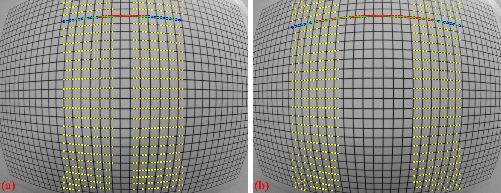
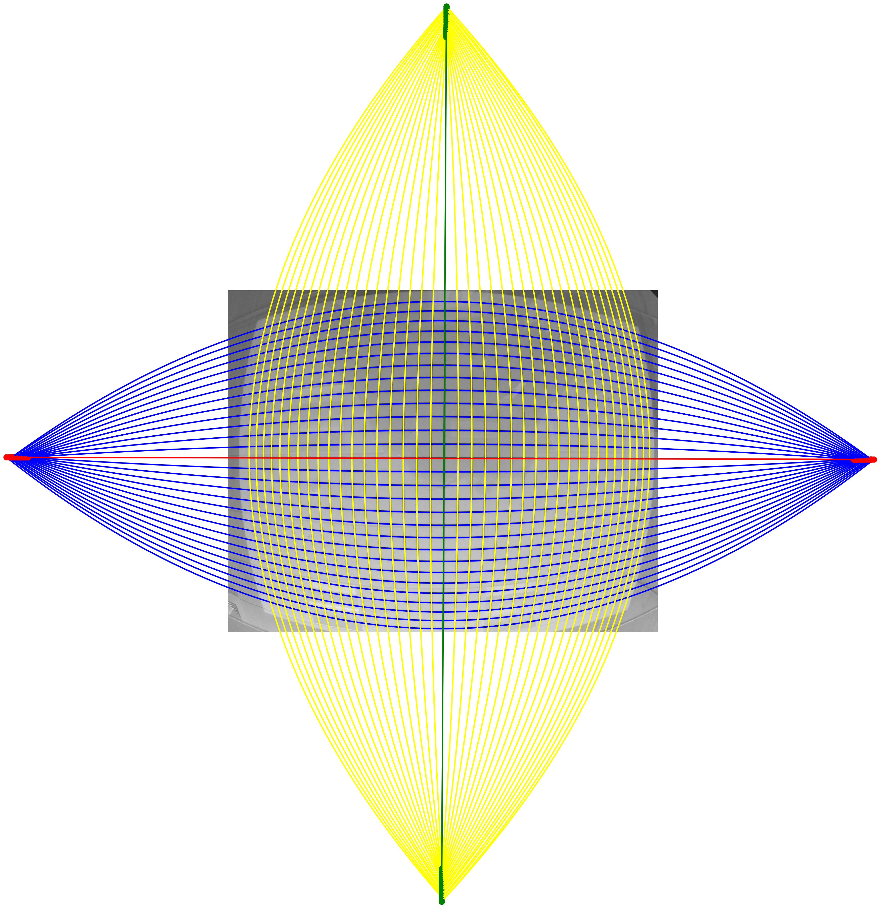
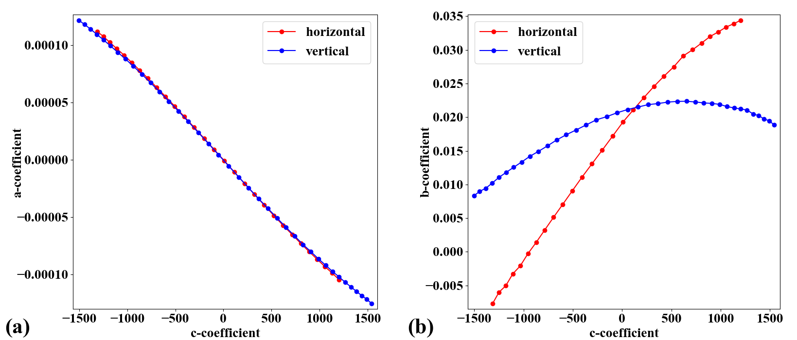
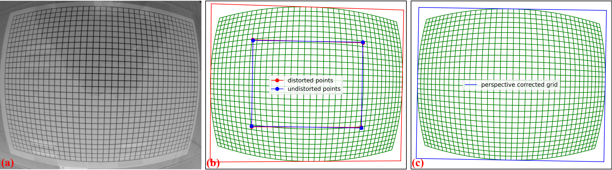

.. _methods:

Methods for correcting distortions
==================================

Introduction
------------

For correcting radial and/or perspective distortion, we need to know a model to
map between distorted space and undistorted space. Mapping from the undistorted
space to the distorted space is the forward mapping (:numref:`fig_5`).
The reverse process is the backward mapping or inverse mapping (:numref:`fig_6`).

.. figure:: figs/methods/fig1.jpg
    :name: fig_5
    :figwidth: 80 %
    :align: center
    :figclass: align-center

    Forward mapping.

.. figure:: figs/methods/fig2.jpg
    :name: fig_6
    :figwidth: 80 %
    :align: center
    :figclass: align-center

    Backward mapping.

There are many models which can be chosen from literature :cite:`Clarke_and_Fryer:1998,
Ricolfe-Viala:2010, Criminisi:1999` such as polynomial, logarithmic, field-of-view,
or matrix-based models to describe the relationship between the undistorted space
and distorted space. Some models were proposed for only one type of distortion while
others are for both distortion types including the location of the optical center.
From a selected model, we can find a practical approach to calculate the parameters
of this model.

To calculate parameters of a distortion model, we have to determine
the coordinates of reference points in the distorted space and their positions
in the undistorted space, correspondingly. Reference points can be extracted
using an image of a `calibration object <https://www.thorlabs.com/newgrouppage9.cfm?objectgroup_id=7501>`__
giving a line or dot-pattern image (:numref:`fig_5`), which is distorted. Using conditions
that lines of these points must be straight, equidistant, parallel, or perpendicular
we can estimate the locations of these reference-points in the undistorted
space with high-accuracy.

Among many models for characterizing radial distortion, the polynomial model is
versatile enough to correct both small-to-medium distortion with sub-pixel accuracy `[Haneishi] <https://doi.org/10.1109/42.414620>`__,
:cite:`Vo:2015` and strong distortion such as fisheye effect `[Basu] <https://doi.org/10.1016/0167-8655(94)00115-J>`__.
For a comprehensive overview of radial distortion correction methods, readers are
recommended to refer to these review articles `[Hughes-2008] <https://doi.org/10.1049/cp:20080656>`__,
`[Hughes-2010] <https://doi.org/10.1364/AO.49.003338>`__, :cite:`Ricolfe-Viala:2010`. When perspective distortion
and optical center offset are present, radial distortion can be calibrated using two main approaches. One approach
is iterative optimization, which uses a cost function to ensure that corrected lines in the undistorted image
appear straight `[Devernay] <https://doi.org/10.1007/PL00013269>`__. Although it requires only a single calibration image,
this method is computationally expensive and does not always guarantee convergence. The other approach relies
on multiple calibration images to estimate all distortion parameters, as implemented in OpenCV. However,
its accuracy is limited because the polynomial model uses only even-order terms `[Zhang] <https://doi.org/10.1109/34.888718>`__.
Therefore, a method for calibrating radial distortion in the presence of other distortions that achieves
high accuracy using only a single calibration image is both practical and crucially needed.

Discorpy is the Python implementation of radial distortion correction methods
presented in :cite:`Vo:2015`. These methods employ polynomial models and use a
calibration image for calculating coefficients of the models where the optical
center is determined independently. The reason of using these models and a
calibration image is to achieve sub-pixel accuracy as strictly required by
parallel-beam tomography systems. The methods were developed and used internally
at the beamline I12 and I13, Diamond Light Source-UK, as Mathematica codes. In 2018, they
were converted to Python codes and packaged as open-source software under the name Vounwarp.
The name was changed to Discorpy in 2021. At the beginning of the software development, only methods
for radial distortion characterization were provided as the optical design of the detection system at I12
features a plug-and-play scintillator that can be swapped with a dot-target, enabling the removal
of perspective distortion. However, in the detection system at I13, replacing the
scintillator with a visible light dot-target is not practical. Instead, an X-ray dot target has been used.
The main disadvantage of this approach is that it is difficult to align the target to minimize
perspective distortion to an ignorable level. To address this problem, starting with version 1.4 of
Discorpy, algorithms for perspective characterization and correction based on :cite:`Criminisi:1999`
has been developed and added to software.

The inclusion of perspective correction independent of radial distortion correction was a significant
development, enabling broader applications of Discorpy beyond scientific purposes. Considering that previous
algorithms in Discorpy were primarily focused on calibrating small-to-medium distortions, methods for calibrating
strong radial distortion, known as fisheye distortion, have been developed, published in :cite:`Vo:2025`, and added to Discorpy
from version 1.7. With this new development, Discorpy and its algorithms stand out for their capability of
independently characterizing both distortion types - radial distortion and perspective distortion of varying strengths - with
high accuracy using a single calibration image. This makes Discorpy a practical tool for a wide range of imaging applications.

.. _reference_points:

Extracting reference-points from a calibration image
----------------------------------------------------

The purpose of a calibration-image (:numref:`fig_14` (a,b,c)) is to provide reference-points
(:numref:`fig_14` (d)) which can be extracted from the image using some image processing
techniques. As shown in :numref:`fig_14`, there are a few calibration-images can be used
in practice. A dot-pattern image (:numref:`fig_14` (a)) is the easiest one to process because we just
need to segment the dots and calculate the center-of-mass of each dot. For a
line-pattern image (:numref:`fig_14` (b)), a line-detection technique is needed. Points on the detected
lines or the crossing points between these lines can be used as reference-points.
For a chessboard image (:numref:`fig_14` (c)), one can employ some corner-detection techniques or
apply a gradient filter to the image and use a line-detection technique.

.. figure:: figs/methods/fig3.jpg
    :name: fig_14
    :figwidth: 80 %
    :align: center
    :figclass: align-center

    (a) Dot-pattern image. (b) Line-pattern image. (c) Chessboard image. (d)
    Extracted reference-points from the image (a),(b), and (c).

In practice, acquired calibration images do not always look nice as shown in :numref:`fig_14`.
Some are very challenging to get reference-points. The following sub-sections present
practical approaches to process calibration images in such cases:

.. toctree::

    methods/dot_pattern
    methods/line_pattern
    methods/chessboard

Grouping reference-points into horizontal lines and vertical lines
------------------------------------------------------------------

Different techniques of calculating parameters of a distortion-model use
reference-points differently. The techniques :cite:`Bailey:2002, Vo:2015`
implemented in Discorpy group reference-points into horizontal lines and
vertical lines (:numref:`fig_15`), represent them by the coefficients of parabolic fits, and
use these coefficients for calculating distortion-parameters.

.. figure:: figs/methods/fig4.png
    :name: fig_15
    :figwidth: 80 %
    :align: center
    :figclass: align-center

    (a) Points are grouped into horizontal lines. (b) Points are grouped
    into vertical lines.

The grouping step is critical in data processing workflow. It dictates the
performance of other methods down the line. In Discorpy, the `grouping method <https://discorpy.readthedocs.io/en/latest/api/discorpy.prep.preprocessing.html#discorpy.prep.preprocessing.group_dots_hor_lines>`__
works by searching the neighbours of a point to decide if they belong to the same
group or not. The search window is defined by the distance between two nearest
reference-points, the slope of the grid, the parameter R, and the acceptable
number of missing points. Depending on the quality of a calibration image, users
may need to tweak parameters of pre-processing methods and/or the grouping method
to get the best results (:numref:`fig_16`).

.. figure:: figs/methods/fig5.png
    :name: fig_16
    :figwidth: 80 %
    :align: center
    :figclass: align-center

    (a) Points extracted from a calibration image including unwanted
    points. (b) Results of applying the grouping method to points in (a).

The introduced method works well for small-to-medium distortions where lines are not strongly curved.
However, for fisheye images, where lines are significantly curved, using the slope (orientation) of
the grid to guide the search is not effective. To address this problem, a different approach has been developed :cite:`Vo:2025`,
where points are grouped from the middle of the image outward, guided by a polynomial fit to locate nearby points.
The process includes two steps: first, in the horizontal direction, points around the center of the image,
where distortion is minimal, are grouped line by line using the previous method. For each group of points, a
parabolic fit is applied. The search window then moves to the next slab (left and right from the center) and
selects points close to the fitted parabola. The parabolic fit is then updated to include the newly grouped points.
This search window continues moving to both sides until the entire image is covered (:numref:`fig_16_1`).

    Demonstration of the grouping method for strongly curved lines: (a) Initial search window, (b) Next search window.

After points are grouped line-by-line, the coordinates of  points on each group are fitted to parabolas in which horizontal lines are
represented by

.. math::
    :label: eq_1

    y = {a_i}{x^2} + {b_i}{x} + {c_i}

and vertical lines by

.. math::
    :label: eq_2

    x = {a_j}{y^2} + {b_j}{y} + {c_j}

where :math:`i`, :math:`j` are the indices of the horizontal and vertical lines, respectively. Noting that the origin
of :math:`x` and :math:`y` corresponds to image coordinate system, i.e. the top-left corner of the image.

.. _calculate_distortion center:

Calculating the optical center of radial distortion
---------------------------------------------------

If there is no perspective distortion, the center of distortion (COD) is determined as explained in :numref:`fig_17` where
(:math:`{x_0}`, :math:`{y_0}`) is the average of the axis intercepts :math:`c` of two
parabolas between which the coefficient :math:`a` changes sign. The slopes of the red
and green line are the average of the :math:`b` coefficients of these parabolas.

.. figure:: figs/methods/fig6.png
    :name: fig_17
    :figwidth: 40 %
    :align: center
    :figclass: align-center

    Intersection between the red and the green line is the CoD.

For calculating the COD with high accuracy, Discorpy implements two methods.
One approach is described in details in :cite:`Bailey:2002` where the linear fit
is applied to a list of (:math:`a`, :math:`c`) coefficients in each direction to
find x-center and y-center of the distortion. Another approach, which is slower
but more accurate, is shown in :cite:`Vo:2015`. The technique varies the COD around
the coarse-estimated COD and calculate a corresponding metric (:numref:`fig_18`). The best
COD is the one having the minimum metric. This approach, however, is sensitive
to perspective distortion. In practice, it is found that the coarse COD is
accurate enough.

.. figure:: figs/methods/fig7.png
    :name: fig_18
    :figwidth: 40 %
    :align: center
    :figclass: align-center

    Metric map of the CoD search.

For cases where perspective distortion is present and radial distortion is not strong, methods
proposed in :cite:`Bailey:2002` can be used. However, for strong radial distortion, two approaches have been developed :cite:`Vo:2025`.
These methods is based on the idea of using vanishing points `[Hughes] <https://doi.org/10.1016/j.imavis.2009.09.001>`__
formed by the intersections of distorted line. However, unlike the approach described in that article, the method
developed for Discorpy uses parabola fitting instead of circular fitting, and it does not attempt to locate four vanishing points.
Instead, the first approach involves finding the intersection points between parabolas with opposite signs of
the :math:`a`-coefficient at the same orientation, e.g., horizontal parabolas. A linear fit is then applied to these points (:numref:`fig_18_1`).
The same process is repeated for vertical parabolas. The intersection of the two fitted lines provides the distortion center.
This method works well only for barrel radial distortion.

    Demonstration of the method for finding the distortion center using the vanishing points

For broader applicability where perspective distortion of calibration image is strong, the second approach is as follows:
for each orientation, e.g., horizontal direction, the parabola with the absolute minimum :math:`a`-coefficient is identified,
then the intersection points between this parabola and the rest are calculated. A linear fit is applied to these points.
The same routine is repeated for vertical direction parabolas. The intersection points of these two fitted lines determine
the calculated center. This entire routine is repeated two or three times to refine the calculated center further by
combining it with perspective distortion correction, as will be shown in the next section.

.. _Correcting perspective effect:

Correcting perspective effect
-----------------------------

In practice, the target object used for acquiring a calibration image is often not aligned parallel to the :ref:`sensor-plane <distortion_causes>`.
This causes perspective distortion in the acquired image, which affects the accuracy of the calculated model for
radial distortion. Perspective distortion can be detected by analyzing the parabolic coefficients of
lines :cite:`Bailey:2002` where the origin of the coordinate system is shifted to the COD, calculated by the approaches
shown in above (:cite:`Bailey:2002` or :cite:`Vo:2025`), before the parabola fitting. :numref:`fig_19` (a) shows the plot of :math:`a`-coefficients against :math:`c`-coefficients
for horizontal lines (Eq. :eq:`eq_1`) and vertical lines (Eq. :eq:`eq_2`). If
there is perspective distortion, the slopes of straight lines fitted to the
plotted data are different. The other consequence is that :math:`b`-coefficients
vary against :math:`c`-coefficients instead of staying the same (:numref:`fig_19` (b)).
For comparison, corresponding plots of parabolic coefficients for the case of no
perspective-distortion are shown in :numref:`fig_20`.

.. figure:: figs/methods/fig8.png
    :name: fig_19
    :figwidth: 90 %
    :align: center
    :figclass: align-center

    Effects of perspective distortion to parabolic coefficients. (a) Between
    :math:`a` and :math:`c`-coefficients. (b) Between :math:`b` and :math:`c`-coefficients.
    Noting that the sign of the :math:`b`-coefficients for vertical lines has been reversed to match
    the sign of the horizontal lines.

.. figure:: figs/methods/fig9.png
    :name: fig_20
    :figwidth: 90 %
    :align: center
    :figclass: align-center

    (a) Corresponding to :numref:`fig_19` (a) without perspective distortion. (b)
    Corresponding to :numref:`fig_19` (b) without perspective distortion.

To calibrate radial distortion, perspective distortion must be corrected first. This can be achieved in two ways.
In the first approach, the coefficients of the parabolic fit are adjusted. Specifically, the :math:`a`- and :math:`c`-
coefficients of parabolas in one direction (e.g., horizontal) are corrected using a ratio calculated as the division
between the average of the differences of :math:`c`-coefficients in the other direction (vertical) and those in
the same direction (horizontal). The :math:`b`-coefficient is simply taken as the value at the intersection of
the fitted lines, as shown in :numref:`fig_19` (b). The grid lines are then regenerated using these updated
coefficients. This approach was introduced from Discorpy 1.4 and works well for small-to-medium radial distortion.
However, for strong distortion - fisheye image, the graphs of :math:`a`-versus-:math:`c`
coefficients and :math:`b`-versus-:math:`c` coefficients are not straight, as shown in :numref:`fig_20_1`.

    Effects of perspective distortion on parabolic coefficients of a strongly distorted grid: (a) Relationship between
    :math:`a`- and :math:`c`-coefficients, (b) :math:`b` and :math:`c`-coefficients.

To address this problem, perspective distortion is calibrated using the fact that the **representative lines**
between directions are perpendicular and using the perspective model presented in the next section.

Calculating coefficients of a correction model for perspective distortion
-------------------------------------------------------------------------

The perspective model is described in :cite:`Criminisi:1999` where the forward mapping between a distorted point and
an undistorted point are given by

.. math::
    :label: eq_9

    x_u = \frac{{k_1^f}{x_d} + {k_2^f}{y_d} + k_3^f}{{k_7^f}{x_d} + {k_8^f}{y_d} + 1}

.. math::
    :label: eq_10

    y_u = \frac{{k_4^f}{x_d} + {k_5^f}{y_d} + k_6^f}{{k_7^f}{x_d} + {k_8^f}{y_d} + 1}

These equations can be `rewritten <https://web.archive.org/web/20150222120106/xenia.media.mit.edu/~cwren/interpolator/>`__
as

.. math::
    :label: eq_11

    \begin{align}
     x_u = &{k_1^f}{x_d} + {k_2^f}{y_d} + k_3^f + 0 \times {k_4^f} + 0 \times {k_5^f} + 0 \times {k_6^f} - {k_7^f}{x_d}{x_u} - {k_8^f}{y_d}{x_u}
    \end{align}

.. math::
    :label: eq_12

    \begin{align}
     y_u = 0 \times {k_1^f} + 0 \times {k_2^f} + 0 \times {k_3^f} + {k_4^f}{x_d} +  {k_5^f}{y_d} + k_6^f - {k_7^f}{x_d}{y_u} - {k_8^f}{y_d}{y_u}
    \end{align}

which can be formulated as a system of linear equations for `n couple-of-points <https://discorpy.readthedocs.io/en/latest/_modules/discorpy/proc/processing.html#calc_perspective_coefficients>`__
(1 distorted point and its corresponding point in the undistorted space).

.. math::
    :label: eq_13

    \begin{align}
    \left( \begin{array}{cccccccc}
      x_{d1} & y_{d1} & 1 & 0  & 0 & 0 & -x_{d1}x_{u1} & -y_{d1}x_{u1} \\
      0 & 0 & 0 & x_{d1} & y_{d1} & 1 & -x_{d1}y_{u1} & -y_{d1}y_{u1} \\
      x_{d2} & y_{d2} & 1 & 0  & 0 & 0 & -x_{d2}x_{u2} & -y_{d2}x_{u2} \\
      0 & 0 & 0 & x_{d2} & y_{d2} & 1 & -x_{d2}y_{u2} & -y_{d2}y_{u2} \\
      \vdots & \vdots & \vdots & \vdots & \vdots & \vdots & \vdots & \vdots \\
      x_{dn} & y_{dn} & 1 & 0  & 0 & 0 & -x_{dn}x_{un} & -y_{dn}x_{un} \\
      0 & 0 & 0 & x_{dn} & y_{dn} & 1 & -x_{dn}y_{un} & -y_{dn}y_{un}
    \end{array} \right)
    \left(\begin{array}{c}
        k_1^f \\ k_2^f \\ k_3^f \\ k_4^f \\ k_5^f \\ k_6^f \\ k_7^f \\ k_8^f
    \end{array} \right)
    = \left(\begin{array}{c}
    x_{u1} \\ y_{u1} \\ x_{u2} \\ y_{u2} \\ \vdots \\ x_{un} \\ y_{un}
    \end{array} \right)
    \end{align}

For the backward mapping, the coordinates of corresponding points in Eq. (9-13)
are simply swapped which results in

.. math::
    :label: eq_14

    x_d = \frac{{k_1^b}{x_u} + {k_2^b}{y_u} + k_3^b}{{k_7^b}{x_u} + {k_8^b}{y_u} + 1}

.. math::
    :label: eq_15

    y_d = \frac{{k_4^b}{x_u} + {k_5^b}{y_u} + k_6^b}{{k_7^b}{x_u} + {k_8^b}{y_u} + 1}

.. math::
    :label: eq_16

    \begin{align}
    \left( \begin{array}{cccccccc}
      x_{u1} & y_{u1} & 1 & 0  & 0 & 0 & -x_{u1}x_{d1} & -y_{u1}x_{d1} \\
      0 & 0 & 0 & x_{u1} & y_{u1} & 1 & -x_{u1}y_{d1} & -y_{u1}y_{d1} \\
      x_{u2} & y_{u2} & 1 & 0  & 0 & 0 & -x_{u2}x_{d2} & -y_{u2}x_{d2} \\
      0 & 0 & 0 & x_{u2} & y_{u2} & 1 & -x_{u2}y_{d2} & -y_{u2}y_{d2} \\
      \vdots & \vdots & \vdots & \vdots & \vdots & \vdots & \vdots & \vdots \\
      x_{un} & y_{un} & 1 & 0  & 0 & 0 & -x_{un}x_{dn} & -y_{un}x_{dn} \\
      0 & 0 & 0 & x_{un} & y_{un} & 1 & -x_{un}y_{dn} & -y_{un}y_{dn}
    \end{array} \right)
    \left(\begin{array}{c}
        k_1^b \\ k_2^b \\ k_3^b \\ k_4^b \\ k_5^b \\ k_6^b \\ k_7^b \\ k_8^b
    \end{array} \right)
    = \left(\begin{array}{c}
    x_{d1} \\ y_{d1} \\ x_{d2} \\ y_{d2} \\ \vdots \\ x_{dn} \\ y_{dn}
    \end{array} \right)
    \end{align}

To find 8 coefficients in Eq. :eq:`eq_13` or Eq. :eq:`eq_16`, the coordinates of
at least 4 couple-of-points are needed where 1 couple-of-points provides 2 equations.
If there are more than 4 couple-of-points, a least square method is used to solve
the equation. Given the coordinates of distorted points on grid lines, using conditions
that lines connecting these points must be parallel, equidistant, or perpendicular
we can calculate the coordinates of undistorted points (:numref:`fig_21`) correspondingly. Details of
this implementation can be found in `Discorpy's API <https://discorpy.readthedocs.io/en/latest/api/discorpy.proc.processing.html#discorpy.proc.processing.generate_source_target_perspective_points>`__.

.. figure:: figs/methods/fig10.png
    :name: fig_21
    :figwidth: 98 %
    :align: center
    :figclass: align-center

    Demonstration of generating undistorted points from perspective
    points. (a) Calibration image. (b) Extracted reference-points. (c) Undistorted
    points generated by using the conditions that lines are parallel in each
    direction, perpendicular between direction, and equidistant. As the scale
    between the distorted space and undistorted space are unknown, the distance
    between lines in the undistorted space can be arbitrarily chosen. Here the
    mean of distances in the distorted space is used.

The following describes the second approach of correcting perspective effect :cite:`Vo:2025` from a radial-distortion
calibration-image, which calculates the coefficients of the above model and applies correction.

First, the distortion center is determined using the vanishing points approach described in the :ref:`above section <calculate_distortion center>`.
The coordinates of the reference points are updated by shifting the origin from the top-left corner of the image to
the distortion center, and the parabola fit is recalculated using the updated coordinates. Next, the intersection of
four lines is found: two in the horizontal direction and two in the vertical direction, as follows. The first horizontal
line is determined by averaging the :math:`b`-coefficients and :math:`c`-coefficients of parabolas with positive :math:`a`-coefficients,
while the second horizontal line is determined using the same approach but applied only to parabolas with negative
:math:`a`-coefficients. The two vertical lines are determined in a similar manner.

From the four intersection points of these lines, the undistorted points can be calculated using the condition that
the lines must be parallel in one direction and perpendicular in the other. The idea involves averaging the slopes
and intercepts to determine the slopes and intercepts of these lines in the undistorted space, and then finding the
intersection of the lines (:numref:`fig_21_1` b). As the scale between the two spaces is uncertain, the average
distance between points is used to define the scale. If the pixel size of the camera is known and the distance between
lines is measured, the scale can be determined more accurately. In such cases, Discorpy provides an option to specify
the scale of the undistorted space. Using these pairs of points between the distorted and undistorted spaces,
perspective distortion coefficients are calculated from Eq. :eq:`eq_9` and Eq. :eq:`eq_10`.
The correction is then applied to all reference points and the results are used in the next step of calibration.

    Demonstration of the method for characterizing perspective distortion: (a) Line-pattern calibration image,
    (b) Grid showing four distorted points and four undistorted points, (c) Corrected grid. Note that the red outline
    frame in (b) and the blue outline frame in (c) highlight the perspective effect before and after correction.

The key development in Discorpy enabling this correction is the accurate determination of the distortion center using
the vanishing point approaches described above. If the distortion center is determined incorrectly, it will
impact the results of perspective distortion correction and then radial distortion correction down the pipeline.

.. _Polynomial model:

Calculating coefficients of a polynomial model for radial-distortion correction
-------------------------------------------------------------------------------

For sub-pixel accuracy, the models chosen in :cite:`Vo:2015` are as follows; for the forward mapping:

.. math::
    :label: eq_3

    \begin{align}
    \frac{r_u}{r_d} = \frac{x_u}{x_d} = \frac{y_u}{y_d} = k_0^f + {k_1^f}{r_d} + {k_2^f}{r_d^2} + {k_3^f}{r_d^3} + .. + {k_n^f}{r_d^n} \equiv F({r_d})
    \end{align}

for the backward mapping:

.. math::
    :label: eq_4

    \begin{align}
    \frac{r_d}{r_u} = \frac{x_d}{x_u} = \frac{y_d}{y_u} = k_0^b + {k_1^b}{r_u} + {k_2^b}{r_u^2} + {k_3^b}{r_u^3} + .. + {k_n^b}{r_u^n} \equiv B({r_u})
    \end{align}

:math:`({x_u}, {y_u})` are the coordinate of a point
in the undistorted space and :math:`{r_u}` is its distance from the COD.
:math:`({x_d}, {y_d}, {r_d})` are for a point in the distorted space. The subscript
:math:`d` is used for clarification. It can be omitted as in Eq. :eq:`eq_1` and
:eq:`eq_2`.

To calculate coefficients of two models, we need to determine
the coordinates of reference-points in both the distorted-space and in the
undistorted-space, correspondingly; and solve a system of linear equations.
In :cite:`Vo:2015` this task is simplified by finding the intercepts of
undistorted lines, :math:`(c_i^u, c_j^u)`, instead. A system of `linear equations <https://discorpy.readthedocs.io/en/latest/api/discorpy.proc.processing.html#discorpy.proc.processing.calc_coef_forward>`__
for finding coefficients of the forward mapping is derived as

.. math::
    :label: eq_5

    \begin{align}
    \left( \begin{array}{ccccc} \vdots & \vdots & \ddots & \vdots & \vdots \\
    1 & r_d & {r_d^2} & \cdots & {r_d^n} \\
    \vdots & \vdots & \ddots & \vdots\\
    1 & r_d & {r_d^2} & \cdots & {r_d^n} \\
    \vdots & \vdots & \ddots & \vdots & \vdots
    \end{array} \right)
    \left(\begin{array}{c}
        k_0^f \\ k_1^f \\ k_2^f \\ \vdots \\ k_n^f
    \end{array} \right)
    = \left(\begin{array}{c}
    \vdots \\ {c_i^u}/({a_i}{x_d^2} + c_i) \\ \vdots \\ {c_j^u}/({a_j}{y_d^2} + c_j) \\ \vdots
    \end{array} \right)
    \end{align}

where each reference-point provides two equations: one associated with a horizontal
line (Eq. :eq:`eq_1`) and one with a vertical line (Eq. :eq:`eq_2`). For the
backward mapping, the `equation system <https://discorpy.readthedocs.io/en/latest/_modules/discorpy/proc/processing.html#calc_coef_backward>`__ is

.. math::
    :label: eq_6

    \begin{align}
    \left( \begin{array}{ccccc} \vdots & \vdots & \ddots & \vdots & \vdots \\
    1 & {r_d}/{F_i} & {r_d^2}/F_i^2 & \cdots & {r_d^n / F_i^n} \\
    \vdots & \vdots & \ddots & \vdots\\
    1 & {r_d}/{F_j} & {r_d^2}/F_j^2 & \cdots & {r_d^n / F_j^n} \\
    \vdots & \vdots & \ddots & \vdots & \vdots
    \end{array} \right)
    \left(\begin{array}{c}
        k_0^b \\ k_1^b \\ k_2^b \\ \vdots \\ k_n^b
    \end{array} \right)
    = \left(\begin{array}{c}
    \vdots \\ F_i \\ \vdots \\ F_j \\ \vdots
    \end{array} \right)
    \end{align}

where :math:`F_i=({a_i}{x_d^2} + c_i)/c_i^u` and
:math:`F_j=({a_j}{y_d^2} + c_j)/c_j^u`. In practice, using distortion coefficients
up to the fifth order is accurate enough, as there is no significant gain in
accuracy with higher order. As can be seen, the number of linear equations, given by
the number of reference-points, is much higher than the number of coefficients.
This is crucial to achieve high accuracy in radial-distortion correction. Because the
strength of distortion varies across an image, providing many reference-points
with high-density improves the robustness of a calculated model.

To solve these above equations we need to determine :math:`c_i^u` and :math:`c_j^u`.
Using the assumption that lines are equidistant, :math:`c_i^u` and :math:`c_j^u` are
calculated by extrapolating from a few lines around the COD as

.. math::
    :label: eq_7

    c_i^u=sgn(c_i) \times \vert (i - i_0) \overline{\Delta{c}} \vert + c_{i_0}

and

.. math::
    :label: eq_8

    c_j^u=sgn(c_j) \times \vert (j - j_0) \overline{\Delta{c}} \vert + c_{j_0}

where the :math:`sgn()` function returns the value of -1, 0, or 1 corresponding
to its input of negative, zero, or positive value. :math:`i_0`, :math:`j_0` are the indices of the
horizontal and vertical line closest to the COD. :math:`\overline{\Delta{c}}` is the average of the difference
of :math:`c_i` near the COD. :math:`\overline{\Delta{c}}` can be refined further
by varying it around an initial guess and find the minimum of :math:`\sum_{i} (c_i - c_i^u)^2`
, which also is provided in the package.

Sometime we need to calculate coefficients of a backward model given that
coefficients of the corresponding forward-model are known, or vice versa. This
is straightforward as one can generate a list of reference-points and calculate
their positions in the opposite space using the known model. From the data-points of
two spaces and using Eq. :eq:`eq_3` or Eq. :eq:`eq_4` directly, a system of linear
equations can be formulated and solved to find the coefficients of the opposite
model. This functionality is available in `Discorpy <https://discorpy.readthedocs.io/en/latest/api/discorpy.proc.processing.html#discorpy.proc.processing.transform_coef_backward_and_forward>`__.

Correcting a distorted image
----------------------------

To correct distorted images, backward models are used because values of
pixels adjacent to a mapped point are known (:numref:`fig_22`). This makes it
easy to perform interpolation.

.. figure:: figs/methods/fig11.png
    :name: fig_22
    :figwidth: 70 %
    :align: center
    :figclass: align-center

    Demonstration of the backward mapping.

For radial distortion; given :math:`({x_u}, {y_u})`
, :math:`({x_{COD}}, {y_{COD}})`, and :math:`(k_0^b, k_1^b,..., k_n^b)` of a backward model;
the `correction routine <https://discorpy.readthedocs.io/en/latest/_modules/discorpy/post/postprocessing.html#unwarp_image_backward>`__
is as follows:

  + -> Translate the coordinates: :math:`x_u = x_u - x_{COD}`;  :math:`y_u = y_u - y_{COD}`.
  + -> Calculate: :math:`r_u = \sqrt{x_u^2 + y_u^2}`;  :math:`r_d = r_u(k_0^b + {k_1^b}{r_u} + {k_2^b}{r_u^2} + ... + {k_n^b}{r_u^n})`.
  + -> Calculate: :math:`x_d = x_u{r_d / r_u}`; :math:`y_d = y_u{r_d / r_u}`.
  + -> Translate the coordinates: :math:`x_d = x_d + x_{COD}`;  :math:`y_d = y_d + y_{COD}`.
  + -> Find 4 nearest grid points of the distorted image by combing two sets of
    [floor(:math:`x_d`), ceil(:math:`x_d`)] and [floor(:math:`y_d`), ceil(:math:`y_d`)].
    Clip values out of the range of the grid.
  + -> Interpolate the value at :math:`({x_d}, {y_d})` using the values of 4 nearest points.
    Assign the result to the point :math:`({x_u}, {y_u})` in the undistorted image.

`Correcting perspective distortion <https://discorpy.readthedocs.io/en/latest/_modules/discorpy/post/postprocessing.html#correct_perspective_image>`__
is straightforward. Given :math:`({x_u}, {y_u})` and coefficients :math:`(k_1^b, k_2^b,..., k_8^b)`, Eq. :eq:`eq_14` :eq:`eq_15`
are used to calculate :math:`x_d`, :math:`y_d`. Then, the image value at this location
is calculated by interpolation as explained above.

Summary
-------

The above sections present a complete workflow of calibrating a lens-coupled detector in a concise way.
It can be divided into three stages: pre-processing stage is for extracting and grouping reference-points
from a calibration image; processing stage is for calculating coefficients of correction models; and
post-processing stage is for correcting images. Discorpy's API is structured following this workflow including
input-output and utility modules.

As shown above, parameters of correction models for radial distortion, the distortion center, and perspective
distortion can be determined independently by using grid lines of reference points extracted from a single
calibration image. This makes Discorpy a practical tool for a wide range of imaging applications. Details
on how to use Discorpy to process real data are provided in :ref:`section 3 <usage>`.
New developments :cite:`Vo:2025` introduced in Discorpy 1.7 for calibrating strong radial distortion (i.e., fisheye distortion)
in the presence of perspective distortion using only a single calibration image are presented in section 4.
