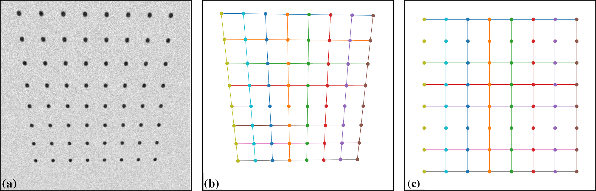

.. _methods:

Methods for correcting distortions
==================================

Introduction
------------

For correcting radial and/or perspective distortion, we need to know a model to
map between distorted space and undistorted space. Mapping from the undistorted
space to the distorted space is the forward mapping (:numref:`fig_5`).
The reverse process is the backward mapping or inverse mapping (:numref:`fig_6`).

    Forward mapping.

.. figure:: figs/methods/fig2.jpg
    :name: fig_6
    :figwidth: 80 %
    :align: center
    :figclass: align-center

    Backward mapping.

There are many models which can be chosen from literature :cite:`Clarke_and_Fryer:1998,
Ricolfe-Viala:2010, Criminisi:1999` such as polynomial, logarithmic, field-of-view,
or matrix-based models to describe the relationship between the undistorted space
and distorted space. Some models were proposed for only one type of distortion while
others are for both distortion types including the location of the optical center.
From a selected model, we can find a practical approach to calculate the parameters
of this model.

To calculate parameters of a distortion model, we have to determine
the coordinates of reference points in the distorted space and their positions
in the undistorted space, correspondingly. Reference points can be extracted
using an image of a `calibration object <https://www.thorlabs.com/newgrouppage9.cfm?objectgroup_id=7501>`__
giving a line or dot-pattern image (:numref:`fig_5`), which is distorted. Using conditions
that lines of these points must be straight, equidistant, parallel, or perpendicular
we can estimate the locations of these reference-points in the undistorted
space with high-accuracy.

Discorpy is the Python implementation of radial distortion correction methods
presented in :cite:`Vo:2015`. These methods employ polynomial models and use a
calibration image for calculating coefficients of the models where the optical
center is determined independently. The reason of using these models and a
calibration image is to achieve sub-pixel accuracy as strictly required by
parallel-beam tomography systems. The methods were developed and used internally
at the beamline I12, Diamond Light Source-UK, as Mathematica codes. In 2018, they
were converted to Python codes and packaged as open-source software :cite:`Vo:2018`
under the name Vounwarp. The name was changed to Discorpy in 2021. From version 1.4,
methods for correcting perspective distortion :cite:`Criminisi:1999` and extracting
reference points from a line-pattern image were added to the software. A key
feature of methods developed and implemented in Discorpy is that radial distortion,
center-of-distortion (optical center), and perspective distortion are determined
independently using a single calibration image. The following sections explain
methods implemented in Discorpy.

.. _reference_points:

Extracting reference-points from a calibration image
----------------------------------------------------

The purpose of a calibration-image (:numref:`fig_14` (a,b,c)) is to provide reference-points
(:numref:`fig_14` (d)) which can be extracted from the image using some image processing
techniques. As shown in :numref:`fig_14`, there are a few calibration-images can be used
in practice. A dot-pattern image (:numref:`fig_14` (a)) is the easiest one to process because we just
need to segment the dots and calculate the center-of-mass of each dot. For a
line-pattern image (:numref:`fig_14` (b)), a line-detection technique is needed. Points on the detected
lines or the crossing points between these lines can be used as reference-points.
For a chessboard image (:numref:`fig_14` (c)), one can employ some corner-detection techniques or
apply a gradient filter to the image and use a line-detection technique.

.. figure:: figs/methods/fig3.jpg
    :name: fig_14
    :figwidth: 80 %
    :align: center
    :figclass: align-center

    (a) Dot-pattern image. (b) Line-pattern image. (c) Chessboard image. (d)
    Extracted reference-points from the image (a),(b), and (c).

In practice, acquired calibration images do not always look nice as shown in :numref:`fig_14`.
Some are very challenging to get reference-points. The following sub-sections present
practical approaches to process calibration images in such cases:

.. toctree::

    methods/dot_pattern
    methods/line_pattern
    methods/chessboard

Grouping reference-points into horizontal lines and vertical lines
------------------------------------------------------------------

Different techniques of calculating parameters of a distortion-model use
reference-points differently. The techniques :cite:`Bailey:2002, Vo:2015`
implemented in Discorpy group reference-points into horizontal lines and
vertical lines (:numref:`fig_15`), represent them by the coefficients of parabolic fits, and
use these coefficients for calculating distortion-parameters.

.. figure:: figs/methods/fig4.png
    :name: fig_15
    :figwidth: 80 %
    :align: center
    :figclass: align-center

    (a) Points are grouped into horizontal lines. (b) Points are grouped
    into vertical lines.

The grouping step is critical in data processing workflow. It dictates the
performance of other methods down the line. In Discorpy, the `grouping method <https://discorpy.readthedocs.io/en/latest/api/discorpy.prep.preprocessing.html#discorpy.prep.preprocessing.group_dots_hor_lines>`__
works by searching the neighbours of a point to decide if they belong to the same
group or not. The search window is defined by the distance between two nearest
reference-points, the slope of the grid, the parameter R, and the acceptable
number of missing points. Depending on the quality of a calibration image, users
may need to tweak parameters of pre-processing methods and/or the grouping method
to get the best results (:numref:`fig_16`).

.. figure:: figs/methods/fig5.png
    :name: fig_16
    :figwidth: 80 %
    :align: center
    :figclass: align-center

    (a) Points extracted from a calibration image including unwanted
    points. (b) Results of applying the grouping method to points in (a).

The coordinates of points on each group are fitted to parabolas in which horizontal
lines are represented by

.. math::
    :label: eq_1

    y = {a_i}{x^2} + {b_i}{x} + {c_i}

and vertical lines by

.. math::
    :label: eq_2

    x = {a_j}{y^2} + {b_j}{y} + {c_j}

where :math:`i`, :math:`j` are the index of the horizontal lines and vertical
lines respectively.

Calculating the optical center of radial distortion
---------------------------------------------------

The coarse estimate of the center of distortion (COD) is explained in :numref:`fig_17` where
(:math:`{x_0}`, :math:`{y_0}`) is the average of the axis intercepts :math:`c` of two
parabolas between which the coefficient :math:`a` changes sign. The slopes of the red
and green line are the average of the :math:`b` coefficients of these parabolas.

    Intersection between the red and the green line is the CoD.

For calculating the COD with high accuracy, Discorpy implements two methods.
One approach is described in details in :cite:`Bailey:2002` where the linear fit
is applied to a list of (:math:`a`, :math:`c`) coefficients in each direction to
find x-center and y-center of the distortion. Another approach, which is slower
but more accurate, is shown in :cite:`Vo:2015`. The technique varies the COD around
the coarse-estimated COD and calculate a corresponding metric (:numref:`fig_18`). The best
COD is the one having the minimum metric. This approach, however, is sensitive
to perspective distortion. In practice, it is found that the coarse COD is
accurate enough.

    Metric map of the CoD search.

.. _Correcting perspective effect:

Correcting perspective effect
-----------------------------

In practice, a target sample may not be mounted in parallel to :ref:`a sensor-plane <distortion_causes>`,
particularly for a high-resolution detector. This causes perspective distortion
in the acquired image which affects the accuracy of a calculated model for radial
distortion. Perspective distortion can be detected by making use of parabolic
coefficients of lines :cite:`Bailey:2002` where the origin of the coordinate system
is shifted to the COD, calculated by the approach in :cite:`Bailey:2002`, before the parabola
fitting. :numref:`fig_19` (a) shows the plot of :math:`a`-coefficients against :math:`c`-coefficients
for horizontal lines (Eq. :eq:`eq_1`) and vertical lines (Eq. :eq:`eq_2`). If
there is perspective distortion, the slopes of straight lines fitted to the
plotted data are different. The other consequence is that :math:`b`-coefficients
vary against :math:`c`-coefficients instead of staying the same (:numref:`fig_19` (b)).
For comparison, corresponding plots of parabolic coefficients for the case of no
perspective-distortion are shown in :numref:`fig_20`.

    Effects of perspective distortion to parabolic coefficients. (a) Between
    :math:`a` and :math:`c`-coefficients. (b) Between :math:`b` and :math:`c`-coefficients.

    (a) Corresponding to :numref:`fig_19` (a) without perspective distortion. (b)
    Corresponding to :numref:`fig_19` (b) without perspective distortion.

In Discorpy 1.4, a method for correcting perspective effect has been developed
and added to the list of functionalities. This is a novel feature and has not yet been published in
a journal. The method works by correcting coefficients of parabolas using the fact that the resulting coefficients have
to satisfy the conditions as shown in :numref:`fig_20`. From the corrected coefficients,
a grid of points are regenerated by finding cross points between parabolas.
Details of the method can be found `here <https://discorpy.readthedocs.io/en/latest/api/discorpy.proc.processing.html#discorpy.proc.processing.regenerate_grid_points_parabola>`__.

.. _Polynomial model:

Calculating coefficients of a polynomial model for radial-distortion correction
-------------------------------------------------------------------------------

For sub-pixel accuracy, the models chosen in :cite:`Vo:2015` are as follows; for the forward mapping:

.. math::
    :label: eq_3

    \begin{align}
    \frac{r_u}{r_d} = \frac{x_u}{x_d} = \frac{y_u}{y_d} = k_0^f + {k_1^f}{r_d} + {k_2^f}{r_d^2} + {k_3^f}{r_d^3} + .. + {k_n^f}{r_d^n} \equiv F({r_d})
    \end{align}

for the backward mapping:

.. math::
    :label: eq_4

    \begin{align}
    \frac{r_d}{r_u} = \frac{x_d}{x_u} = \frac{y_d}{y_u} = k_0^b + {k_1^b}{r_u} + {k_2^b}{r_u^2} + {k_3^b}{r_u^3} + .. + {k_n^b}{r_u^n} \equiv B({r_u})
    \end{align}

:math:`({x_u}, {y_u})` are the coordinate of a point
in the undistorted space and :math:`{r_u}` is its distance from the COD.
:math:`({x_d}, {y_d}, {r_d})` are for a point in the distorted space. The subscript
:math:`d` is used for clarification. It can be omitted as in Eq. :eq:`eq_1` and
:eq:`eq_2`.

To calculate coefficients of two models, we need to determine
the coordinates of reference-points in both the distorted-space and in the
undistorted-space, correspondingly; and solve a system of linear equations.
In :cite:`Vo:2015` this task is simplified by finding the intercepts of
undistorted lines, :math:`(c_i^u, c_j^u)`, instead. A system of `linear equations <https://discorpy.readthedocs.io/en/latest/api/discorpy.proc.processing.html#discorpy.proc.processing.calc_coef_forward>`__
for finding coefficients of the forward mapping is derived as

.. math::
    :label: eq_5

    \begin{align}
    \left( \begin{array}{ccccc} \vdots & \vdots & \ddots & \vdots & \vdots \\
    1 & r_d & {r_d^2} & \cdots & {r_d^n} \\
    \vdots & \vdots & \ddots & \vdots\\
    1 & r_d & {r_d^2} & \cdots & {r_d^n} \\
    \vdots & \vdots & \ddots & \vdots & \vdots
    \end{array} \right)
    \left(\begin{array}{c}
        k_0^f \\ k_1^f \\ k_2^f \\ \vdots \\ k_n^f
    \end{array} \right)
    = \left(\begin{array}{c}
    \vdots \\ {c_i^u}/({a_i}{x_d^2} + c_i) \\ \vdots \\ {c_j^u}/({a_j}{y_d^2} + c_j) \\ \vdots
    \end{array} \right)
    \end{align}

where each reference-point provides two equations: one associated with a horizontal
line (Eq. :eq:`eq_1`) and one with a vertical line (Eq. :eq:`eq_2`). For the
backward mapping, the `equation system <https://discorpy.readthedocs.io/en/latest/_modules/discorpy/proc/processing.html#calc_coef_backward>`__ is

.. math::
    :label: eq_6

    \begin{align}
    \left( \begin{array}{ccccc} \vdots & \vdots & \ddots & \vdots & \vdots \\
    1 & {r_d}/{F_i} & {r_d^2}/F_i^2 & \cdots & {r_d^n / F_i^n} \\
    \vdots & \vdots & \ddots & \vdots\\
    1 & {r_d}/{F_j} & {r_d^2}/F_j^2 & \cdots & {r_d^n / F_j^n} \\
    \vdots & \vdots & \ddots & \vdots & \vdots
    \end{array} \right)
    \left(\begin{array}{c}
        k_0^b \\ k_1^b \\ k_2^b \\ \vdots \\ k_n^b
    \end{array} \right)
    = \left(\begin{array}{c}
    \vdots \\ F_i \\ \vdots \\ F_j \\ \vdots
    \end{array} \right)
    \end{align}

where :math:`F_i=({a_i}{x_d^2} + c_i)/c_i^u` and
:math:`F_j=({a_j}{y_d^2} + c_j)/c_j^u`. In practice, using distortion coefficients
up to the fifth order is accurate enough, as there is no significant gain in
accuracy with higher order. As can be seen, the number of linear equations, given by
the number of reference-points, is much higher than the number of coefficients.
This is crucial to achieve high accuracy in radial-distortion correction. Because the
strength of distortion varies across an image, providing many reference-points
with high-density improves the robustness of a calculated model.

To solve these above equations we need to determine :math:`c_i^u` and :math:`c_j^u`.
Using the assumption that lines are equidistant, :math:`c_i^u` and :math:`c_j^u` are
calculated by extrapolating from a few lines around the COD as

.. math::
    :label: eq_7

    c_i^u=sgn(c_i) \times \vert (i - i_0) \overline{\Delta{c}} \vert + c_{i_0}

and

.. math::
    :label: eq_8

    c_j^u=sgn(c_j) \times \vert (j - j_0) \overline{\Delta{c}} \vert + c_{j_0}

where the :math:`sgn()` function returns the value of -1, 0, or 1 corresponding
to its input of negative, zero, or positive value. :math:`i_0` is the index of the line
closest to the COD. :math:`\overline{\Delta{c}}` is the average of the difference
of :math:`c_i` near the COD. :math:`\overline{\Delta{c}}` can be refined further
by varying it around an initial guess and find the minimum of :math:`\sum_{i} (c_i - c_i^u)^2`
, which also is provided in the package.

Sometime we need to calculate coefficients of a backward model given that
coefficients of the corresponding forward-model are known, or vice versa. This
is straightforward as one can generate a list of reference-points and calculate
their positions in the opposite space using the known model. From the data-points of
two spaces and using Eq. :eq:`eq_3` or Eq. :eq:`eq_4` directly, a system of linear
equations can be formulated and solved to find the coefficients of the opposite
model. This functionality is available in `Discorpy <https://discorpy.readthedocs.io/en/latest/api/discorpy.proc.processing.html#discorpy.proc.processing.transform_coef_backward_and_forward>`__.

Calculating coefficients of a correction model for perspective distortion
-------------------------------------------------------------------------

The forward mapping between a distorted point and an undistorted point are given
by :cite:`Criminisi:1999`

.. math::
    :label: eq_9

    x_u = \frac{{k_1^f}{x_d} + {k_2^f}{y_d} + k_3^f}{{k_7^f}{x_d} + {k_8^f}{y_d} + 1}

.. math::
    :label: eq_10

    y_u = \frac{{k_4^f}{x_d} + {k_5^f}{y_d} + k_6^f}{{k_7^f}{x_d} + {k_8^f}{y_d} + 1}

These equations can be `rewritten <https://web.archive.org/web/20150222120106/xenia.media.mit.edu/~cwren/interpolator/>`__
as

.. math::
    :label: eq_11

    \begin{align}
     x_u = &{k_1^f}{x_d} + {k_2^f}{y_d} + k_3^f + 0 \times {k_4^f} + 0 \times {k_5^f} + 0 \times {k_6^f} - {k_7^f}{x_d}{x_u} - {k_8^f}{y_d}{x_u}
    \end{align}

.. math::
    :label: eq_12

    \begin{align}
     y_u = 0 \times {k_1^f} + 0 \times {k_2^f} + 0 \times {k_3^f} + {k_4^f}{x_d} +  {k_5^f}{y_d} + k_6^f - {k_7^f}{x_d}{y_u} - {k_8^f}{y_d}{y_u}
    \end{align}

which can be formulated as a system of linear equations for `n couple-of-points <https://discorpy.readthedocs.io/en/latest/_modules/discorpy/proc/processing.html#calc_perspective_coefficients>`__
(1 distorted point and its corresponding point in the undistorted space).

.. math::
    :label: eq_13

    \begin{align}
    \left( \begin{array}{cccccccc}
      x_{d1} & y_{d1} & 1 & 0  & 0 & 0 & -x_{d1}x_{u1} & -y_{d1}x_{u1} \\
      0 & 0 & 0 & x_{d1} & y_{d1} & 1 & -x_{d1}y_{u1} & -y_{d1}y_{u1} \\
      x_{d2} & y_{d2} & 1 & 0  & 0 & 0 & -x_{d2}x_{u2} & -y_{d2}x_{u2} \\
      0 & 0 & 0 & x_{d2} & y_{d2} & 1 & -x_{d2}y_{u2} & -y_{d2}y_{u2} \\
      \vdots & \vdots & \vdots & \vdots & \vdots & \vdots & \vdots & \vdots \\
      x_{dn} & y_{dn} & 1 & 0  & 0 & 0 & -x_{dn}x_{un} & -y_{dn}x_{un} \\
      0 & 0 & 0 & x_{dn} & y_{dn} & 1 & -x_{dn}y_{un} & -y_{dn}y_{un}
    \end{array} \right)
    \left(\begin{array}{c}
        k_1^f \\ k_2^f \\ k_3^f \\ k_4^f \\ k_5^f \\ k_6^f \\ k_7^f \\ k_8^f
    \end{array} \right)
    = \left(\begin{array}{c}
    x_{u1} \\ y_{u1} \\ x_{u2} \\ y_{u2} \\ \vdots \\ x_{un} \\ y_{un}
    \end{array} \right)
    \end{align}

For the backward mapping, the coordinates of corresponding points in Eq. (9-13)
are simply swapped which results in

.. math::
    :label: eq_14

    x_d = \frac{{k_1^b}{x_u} + {k_2^b}{y_u} + k_3^b}{{k_7^b}{x_u} + {k_8^b}{y_u} + 1}

.. math::
    :label: eq_15

    y_d = \frac{{k_4^b}{x_u} + {k_5^b}{y_u} + k_6^b}{{k_7^b}{x_u} + {k_8^b}{y_u} + 1}

.. math::
    :label: eq_16

    \begin{align}
    \left( \begin{array}{cccccccc}
      x_{u1} & y_{u1} & 1 & 0  & 0 & 0 & -x_{u1}x_{d1} & -y_{u1}x_{d1} \\
      0 & 0 & 0 & x_{u1} & y_{u1} & 1 & -x_{u1}y_{d1} & -y_{u1}y_{d1} \\
      x_{u2} & y_{u2} & 1 & 0  & 0 & 0 & -x_{u2}x_{d2} & -y_{u2}x_{d2} \\
      0 & 0 & 0 & x_{u2} & y_{u2} & 1 & -x_{u2}y_{d2} & -y_{u2}y_{d2} \\
      \vdots & \vdots & \vdots & \vdots & \vdots & \vdots & \vdots & \vdots \\
      x_{un} & y_{un} & 1 & 0  & 0 & 0 & -x_{un}x_{dn} & -y_{un}x_{dn} \\
      0 & 0 & 0 & x_{un} & y_{un} & 1 & -x_{un}y_{dn} & -y_{un}y_{dn}
    \end{array} \right)
    \left(\begin{array}{c}
        k_1^b \\ k_2^b \\ k_3^b \\ k_4^b \\ k_5^b \\ k_6^b \\ k_7^b \\ k_8^b
    \end{array} \right)
    = \left(\begin{array}{c}
    x_{d1} \\ y_{d1} \\ x_{d2} \\ y_{d2} \\ \vdots \\ x_{dn} \\ y_{dn}
    \end{array} \right)
    \end{align}

To find 8 coefficients in Eq. :eq:`eq_13` or Eq. :eq:`eq_16`, the coordinates of
at least 4 couple-of-points are needed where 1 couple-of-points provides 2 equations.
If there are more than 4 couple-of-points, a least square method is used to solve
the equation. Given the coordinates of distorted points on grid lines, using conditions
that lines connecting these points must be parallel, equidistant, or perpendicular
we can calculate the coordinates of undistorted points (:numref:`fig_21`) correspondingly. Details of
this implementation can be found in `Discorpy's API <https://discorpy.readthedocs.io/en/latest/api/discorpy.proc.processing.html#discorpy.proc.processing.generate_source_target_perspective_points>`__.

    Demonstration of generating undistorted points from perspective
    points. (a) Calibration image. (b) Extracted reference-points. (c) Undistorted
    points generated by using the conditions that lines are parallel in each
    direction, perpendicular between direction, and equidistant. As the scale
    between the distorted space and undistorted space are unknown, the distance
    between lines in the undistorted space can be arbitrarily chosen. Here the
    mean of distances in the distorted space is used.

Correcting a distorted image
----------------------------

To correct distorted images, backward models are used because values of
pixels adjacent to a mapped point are known (:numref:`fig_22`). This makes it
easy to perform interpolation.

    Demonstration of the backward mapping.

For radial distortion; given :math:`({x_u}, {y_u})`
, :math:`({x_{COD}}, {y_{COD}})`, and :math:`(k_0^b, k_1^b,..., k_n^b)` of a backward model;
the `correction routine <https://discorpy.readthedocs.io/en/latest/_modules/discorpy/post/postprocessing.html#unwarp_image_backward>`__
is as follows:

  + -> Translate the coordinates: :math:`x_u = x_u - x_{COD}`;  :math:`y_u = y_u - y_{COD}`.
  + -> Calculate: :math:`r_u = \sqrt{x_u^2 + y_u^2}`;  :math:`r_d = r_u(k_0^b + {k_1^b}{r_u} + {k_2^b}{r_u^2} + ... + {k_n^b}{r_u^n})`.
  + -> Calculate: :math:`x_d = x_u{r_d / r_u}`; :math:`y_d = y_u{r_d / r_u}`.
  + -> Translate the coordinates: :math:`x_d = x_d + x_{COD}`;  :math:`y_d = y_d + y_{COD}`.
  + -> Find 4 nearest grid points of the distorted image by combing two sets of
    [floor(:math:`x_d`), ceil(:math:`x_d`)] and [floor(:math:`y_d`), ceil(:math:`y_d`)].
    Clip values out of the range of the grid.
  + -> Interpolate the value at :math:`({x_d}, {y_d})` using the values of 4 nearest points.
    Assign the result to the point :math:`({x_u}, {y_u})` in the undistorted image.

`Correcting perspective distortion <https://discorpy.readthedocs.io/en/latest/_modules/discorpy/post/postprocessing.html#correct_perspective_image>`__
is straightforward. Given :math:`({x_u}, {y_u})` and coefficients :math:`(k_1^b, k_2^b,..., k_8^b)`, Eq. :eq:`eq_14` :eq:`eq_15`
are used to calculate :math:`x_d`, :math:`y_d`. Then, the image value at this location
is calculated by interpolation as explained above.

Summary
-------

The above sections present a complete workflow of calibrating a lens-coupled
detector in a concise way. It can be divided into three stages: pre-processing
stage is for extracting and grouping reference-points from a calibration image;
processing stage is for calculating coefficients of correction models; and
post-processing stage is for correcting images. Discorpy's API is structured
following this workflow including an input-output module.

As shown above, parameters of correction models for radial distortion and
perspective distortion can be determined independently because reference-points
in the undistorted space can be generated easily using methods available in
Discorpy. Details of how to use Discorpy to process real data are shown
in :ref:`section 3 <usage>`.
