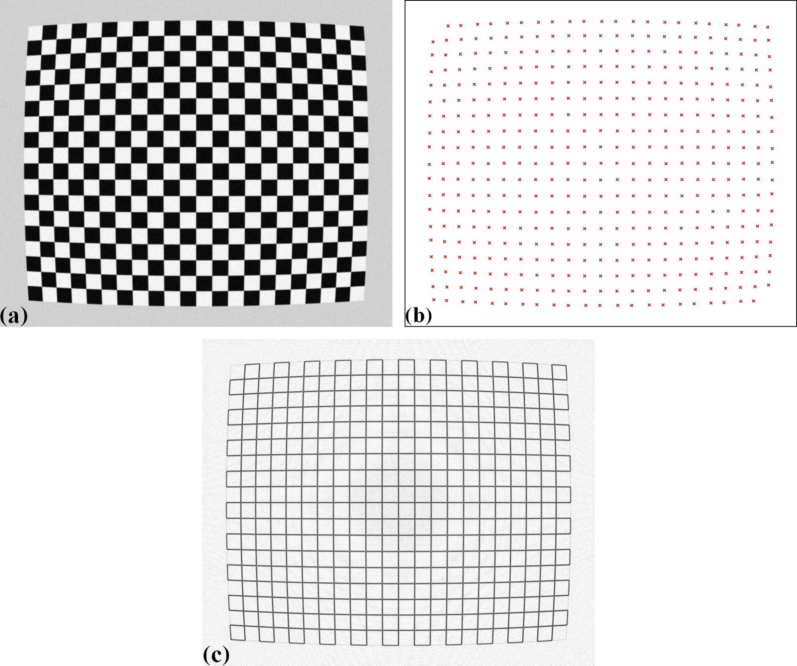

Pre-processing techniques for a chessboard image
================================================

Chessboard images are often used to calibrate commercial cameras rather than
scientific cameras. To get reference-points, users can apply some corner-detection
methods available in `Scikit-image <https://scikit-image.org/docs/dev/auto_examples/features_detection/plot_corner.html>`__
(:numref:`fig_13` (a)(b)), or convert the image to a line-pattern image (Fig. 1(c)) and use
the similar routine as described in :ref:`section 2.2.2.2 <line_pattern>`.

  (a) Chessboard image. (b) Points extracted using a corner-detection method.
  (c) Converted image from image (a).