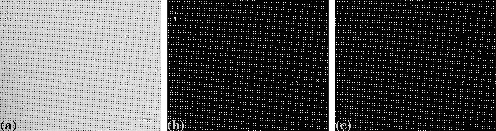

Pre-processing techniques for a dot-pattern image
=================================================

**Binarization**

Dots are extracted from a calibration image by binarization (Fig. 1). Then the
center-of-mass of each segmented dot is calculated and used as a reference-point.

  Figure 1. Demonstration of the image binarization. (a) Dot-pattern image.
  (b) Segmented dots.

**Normalizing background**

The binarization uses a global thresholding `method <https://en.wikipedia.org/wiki/Otsu's_Method>`_.
In some cases, the background of an image is non-uniform which affects the
performance of the thresholding method. *Discorpy* provides two ways of normalizing
the background of an image: using a strong low-pass filter (Fig. 2) or using a
median filter with a large-size window.

  Figure 2. Demonstration of background normalization. (a) Dot-pattern image
  (X-ray target). (b) Extracted background. (c) Corrected image.

**Removing non-dot objects**

*Discorpy* provides two methods for removing non-dot objects after a binarization step.
In the first approach, the median size of dots (MS) is determined, then only
objects with sizes in the range of (MS–R*MS; MS+R*MS) are kept where R (ratio)
is a parameter. In the second approach, the ratio between the largest axis and
the smallest axis of the best-fit ellipse is used. Objects with the ratios out
of the range of (1.0; 1.0+R) are removed.

  Figure 3. Demonstration of removing non-dot objects.(a) Dot-pattern image
  (X-ray target). (b) Binary image. (c) Image with non-dot objects removed.

**Removing misplaced dots**

Custom-made dot-patterns may have dots placed in wrong positions as shown in
Fig. 4. In *Discorpy*, a misplaced dot is identified by using its distances to
four nearest dots. If none of the distances is in the range of
(MD–R*MD; MD+R*MD), where MD is the median distance of two nearest dots and R
is a parameter, the dot is removed. This method, however, should not be used for an
image with strong distortion where the distance of two nearest dots changes
significantly against their distances from the optical center. A more generic
approach to tackle the problem is shown in section 2.2.3.

  Figure 4. (a) Image with a misplaced dot. (b) Binary image. (c) Image with
  misplaced dot removed.
