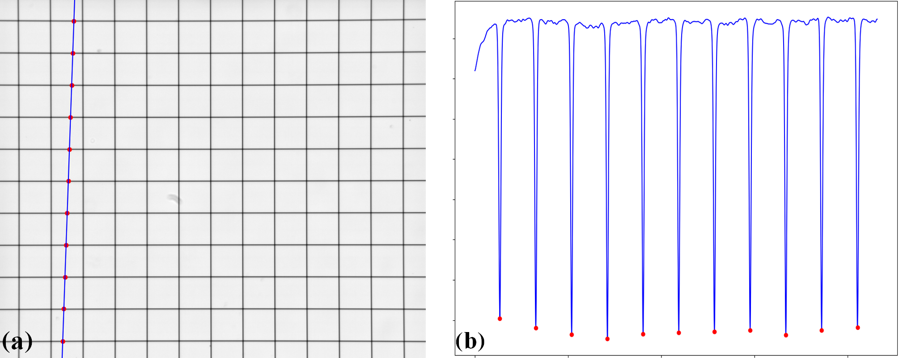
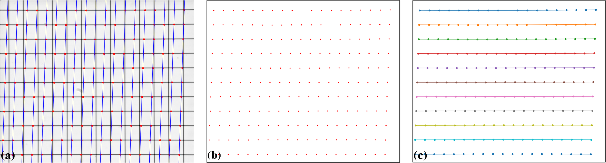

.. _line_pattern:

Pre-processing techniques for a line-pattern image
==================================================

As lines in a calibration image are curved under radial distortion, using
well-known line-detection methods such as Hough transform-based approaches
are not always feasible. A simple method for detecting curved lines has been
developed for Discorpy 1.4 where points on each line are detected by locating
local extrema points on an intensity-profile generated by plotting across the
image (Fig. 1). Many intensity-profiles are generated to detect points on lines
at different locations, then they are grouped line-by-line (Fig. 2).

  Figure 1. Process of locating points belong to a line. (a) Intensity-profile
  extracted along the blue line. (b) Local minimum points located on this profile.

  Figure 2. Full routine of detecting lines. (a) Multiple crossing-lines are
  used to locate extrema points. (b) Points extracted. (c) Points after grouped
  into lines.