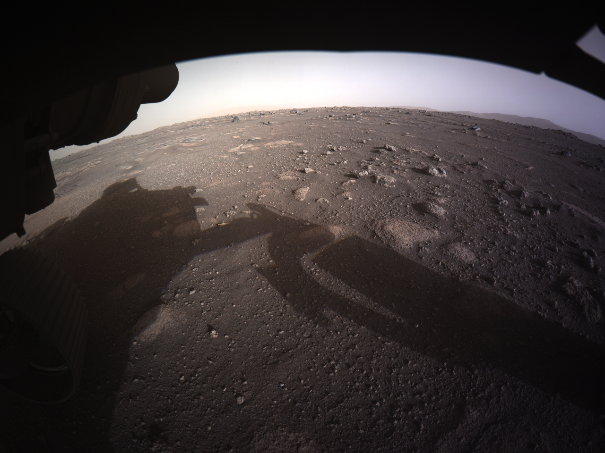
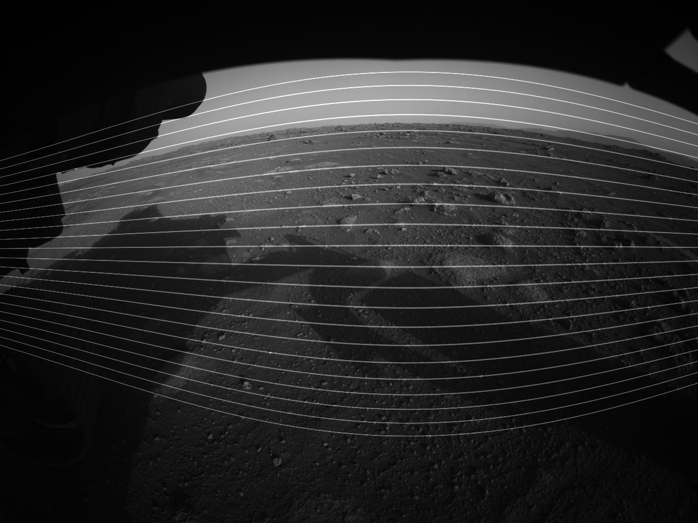
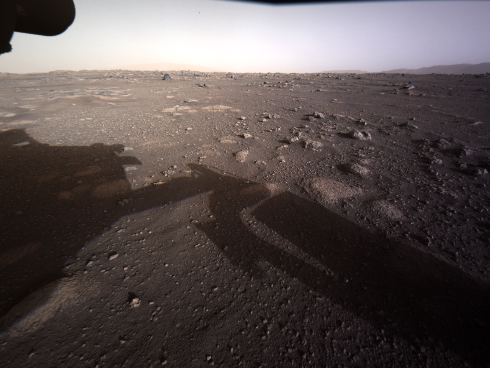
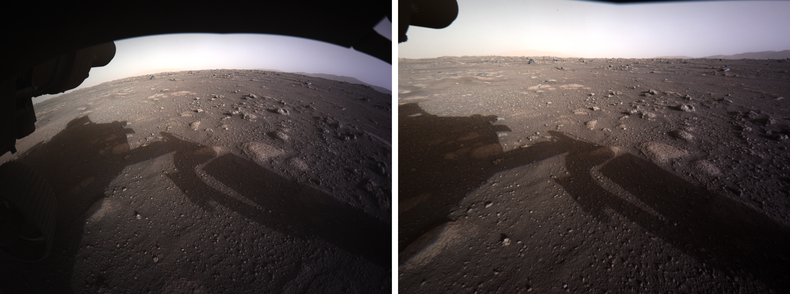

### Demonstration of correcting radial distortion of Perseverance's camera
The first high-resolution, color image sent back by the Hazard Cameras 
on the underside of NASA’s Perseverance Mars rover is very
exciting. However, we clearly see the distortion problem of this camera.



As we can't calibrate the camera, a practical approach is to guess using 
the skyline as a reference line (it may not be straight though). 

Guessing parameters of a forward model is much easier than a backward model. 
To do that I create a line-pattern image, apply an estimated forward mapping, 
and overlay on the original image to check by eyes.

  

```python
import numpy as np
import vounwarp.losa.loadersaver as io
import vounwarp.post.postprocessing as post

# Load image
mat0 = io.load_image("Sol0_1st_color.png")
output_base = "figs/"
(height, width) = mat0.shape
mat0 = mat0 / np.max(mat0)

# Create a line-pattern image
line_pattern = np.zeros((height, width), dtype=np.float32)
for i in range(50, height - 50, 40):
    line_pattern[i - 1:i + 2] = 1.0

# Estimate parameters by visual inspection.
# Coarse estimation
xcenter = width / 2.0 + 110.0
ycenter = height / 2.0 - 20.0
list_pow = np.asarray([1.0, 10**(-4), 10**(-7), 10**(-10), 10**(-13)])
# Fine estimation
list_coef = np.asarray([1.0, 4.0, 5.0, 17.0, 3.0])
list_ffact = list_pow * list_coef

pad = width
mat_pad = np.pad(line_pattern, pad, mode='edge')
mat_cor = post.unwarp_image_backward(mat_pad, xcenter + pad, ycenter + pad, list_ffact)
mat_cor = mat_cor[pad:pad + height, pad:pad + width]
io.save_image(output_base + "/overlay.jpg", (mat0 + 0.5*mat_cor))
```
From the estimated parameters of the forward model, we can calculate parameters
of a backward model which will be used for image correction.
```python
import numpy as np
import vounwarp.losa.loadersaver as io
import vounwarp.post.postprocessing as post

# Load image
mat0 = io.load_image("Sol0_1st_color.png")
output_base = "figs/"
(height, width) = mat0.shape
mat0 = mat0 / np.max(mat0)

# Estimated forward model
xcenter = width / 2.0 + 110.0
ycenter = height / 2.0 - 20.0
list_pow = np.asarray([1.0, 10**(-4), 10**(-7), 10**(-10), 10**(-13)])
list_coef = np.asarray([1.0, 4.0, 5.0, 17.0, 3.0])
list_ffact = list_pow * list_coef

# Calculate parameters of a backward model from the estimated forward model
list_hor_lines = []
for i in range(20, height-20, 50):
    list_tmp = []
    for j in range(20, width-20, 50):
        list_tmp.append([i - ycenter, j - xcenter])
    list_hor_lines.append(list_tmp)
Amatrix = []
Bmatrix = []
list_expo = np.arange(len(list_ffact), dtype=np.int16)
for _, line in enumerate(list_hor_lines):
    for _, point in enumerate(line):
        xd = np.float64(point[1])
        yd = np.float64(point[0])
        rd = np.sqrt(xd * xd + yd * yd)
        ffactor = np.float64(np.sum(list_ffact * np.power(rd, list_expo)))
        if ffactor != 0.0:
            Fb = 1 / ffactor
            ru = ffactor * rd
            Amatrix.append(np.power(ru, list_expo))
            Bmatrix.append(Fb)
Amatrix = np.asarray(Amatrix, dtype=np.float64)
Bmatrix = np.asarray(Bmatrix, dtype=np.float64)
list_bfact = np.linalg.lstsq(Amatrix, Bmatrix, rcond=1e-64)[0]

# Apply distortion correction
corrected_mat = post.unwarp_image_backward(mat0, xcenter, ycenter, list_bfact)
io.save_image(output_base + "/after.png", corrected_mat)
io.save_image(output_base + "/before.png", mat0)
io.save_metadata_txt(output_base + "/coefficients.txt", xcenter, ycenter, list_bfact)
```
Knowing the parameters of the backward model, distortion correction can 
easily be applied to other images of that camera.
```python
import numpy as np
import vounwarp.losa.loadersaver as io
import vounwarp.post.postprocessing as post
from PIL import Image

# Load color image
file_path = "Sol0_1st_color.png"
output_base = "figs/"
mat = np.asarray(Image.open(file_path), dtype=np.float32)
# Import distortion coefficients
(xcenter, ycenter, list_fact) = io.load_metadata_txt("figs/coefficients.txt")

for i in range(mat.shape[-1]):
    mat[:, :, i] = post.unwarp_image_backward(mat[:, :, i], xcenter, ycenter, list_fact)
io.save_image(output_base + "/Sol0_1st_color_correction.png", mat)
```
 

Combination of the images before and after distortion correction for comparison:


